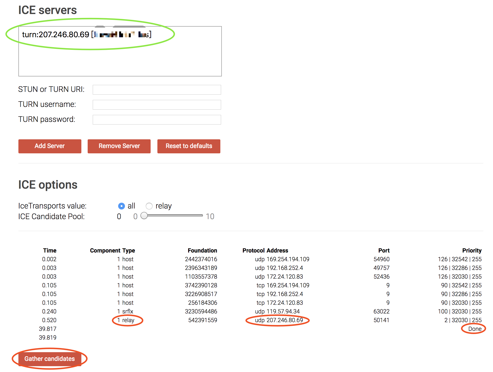

想在公网上实现视频通信，需要下面3个核心元素：

1. 一个是NAT穿透服务器(ICE Server)，实现内网穿透。
2. 基于WebSocket的信令服务器(Signaling Server)，用于建立点对点的通道。
3. Web客户端。通过H5的WebRTC特性调用摄像头，进行用户交互。

<!-- more -->

## 1. 搭建NAT穿透服务器coturn

+ 教程:

https://github.com/coturn/coturn/wiki/README


+ 准备工作: 

```shell
sudo yum install gcc
sudo yum install openssl-devel
sudo yum install libevent
sudo yum install libevent-devel
sudo yum install sqlite
sudo yum install sqlite-devel

参见: https://github.com/coturn/coturn/blob/master/INSTALL
```


+ 开始安装:

```shell
git clone https://github.com/coturn/coturn
./configure
make
sudo make install
```


+ 启动:

```shell
cp examples/etc/turnserver.conf bin/turnserver.conf
vi bin/turnserver.conf

修改配置turnserver.conf，如下：
#监听端口 
listening-port=3478 
#内网IP 
listening-ip=你的服务器内网IP
#外网IP地址 
external-ip=你的服务器外网IP
#访问的用户、密码 
user=user:password


cd bin
turnserver -v -r 207.246.80.69:3478 -a -o  //207.246.80.69是我的服务器外网地址
```


+ 测试:

打开 [https://webrtc.github.io/samples/src/content/peerconnection/trickle-ice/ ](https://webrtc.github.io/samples/src/content/peerconnection/trickle-ice/)进行测试




测试时可以看log (https://github.com/coturn/coturn/wiki/README#logs)

```
tail -f /var/tmp/turn_日期.log 
```


## 2. 搭建信令服务器simplemaster

 信令服务器使用的是 [**signalmaster**](https://github.com/andyet/signalmaster) ，基于websocket。选用它的原因是可以直接集成turn server服务器。

```shell
git clone https://github.com/andyet/signalmaster.git
cd signalmaster
npm install express
npm install yetify
npm install getconfig
npm install node-uuid
npm install socket.io


或者

git clone https://github.com/nguyenphu160196/signalmaster.git
cd signalmaster
npm install
```


signalmaster可以连接turnserver，但不支持用户名/密码方式，需要对源码sockets.js 110行进行调整，调整后的代码如下：

```javascript
    if (!config.turnorigins || config.turnorigins.indexOf(origin) !== -1) {
            config.turnservers.forEach(function (server) {
                credentials.push({
                    username: server.username,
                    credential: server.credential,
                    urls: server.urls || server.url
                });
            });
        }

```


完成后，修改config/production.json，配置turnserver的用户和密码，如下：

```json
{
  "isDev": true,
  "server": {
    "port": 8888,
    "/* secure */": "/* whether this connects via https */",
    "secure": false,
    "key": null,
    "cert": null,
    "password": null
  },
  "rooms": {
    "/* maxClients */": "/* maximum number of clients per room. 0 = no limit */",
    "maxClients": 0
  },
  "stunservers": [
    {
      "urls": "stun:stun.ekiga.net:3478"
    }
  ],
  "turnservers": [
    {
      "urls": ["turn:www.turn.cn:3478"],
      "username": "user",
      "credential":"pass",  
      "expiry": 86400
    }
  ]
}
```


启动:

```shell
nohup node server.js &

//Output:
&yet -- signal master is running at: http://localhost:8888
```


## 3. 搭建Web客户端

复制下面的代码，保存为一个html文件, 放在自己的服务器上

```html

<!DOCTYPE html>
<html>
<head>
    <script src="https://code.jquery.com/jquery-1.9.1.js"></script>
    <script src="http://simplewebrtc.com/latest-v3.js"></script>
    <script>
 
        var webrtc = new SimpleWebRTC({
            // the id/element dom element that will hold "our" video
            localVideoEl: 'localVideo',
            // the id/element dom element that will hold remote videos
            remoteVideosEl: 'remoteVideos',
            // immediately ask for camera access
            autoRequestMedia: true,
            url:'http://207.246.80.69:8888',
            nick:'nickname'
        });
 
 
 
        // we have to wait until it's ready
        webrtc.on('readyToCall', function () {
            // you can name it anything
            webrtc.joinRoom('roomid');
 
            // Send a chat message
            $('#send').click(function () {
                var msg = $('#text').val();
                webrtc.sendToAll('chat', { message: msg, nick: webrtc.config.nick });
                $('#messages').append('<br>You:<br>' + msg + '\n');
                $('#text').val('');
            });
        });
 
        //For Text Chat ------------------------------------------------------------------
        // Await messages from others
        webrtc.connection.on('message', function (data) {
            if (data.type === 'chat') {
                console.log('chat received', data);
                $('#messages').append('<br>' + data.payload.nick + ':<br>' + data.payload.message+ '\n');
            }
        });
        
    </script>
    <style>
        #remoteVideos video {
            height: 150px;
        }
 
        #localVideo {
            height: 150px;
        }
    </style>
</head>
<body>
    <textarea id="messages" rows="5" cols="20"></textarea><br />
    <input id="text" type="text" />
    <input id="send" type="button" value="send" /><br />
    <video id="localVideo"></video>
    <div id="remoteVideos"></div>
</body>
</html>
```


nginx配置:

```nginx
server {
        listen 8080 default_server;
        listen [::]:8080 default_server;

        root /home/liuwei/web;
        index index.html;
}
```

+ 打开firefox开始测试  http://207.246.80.69:8080, chrome需要https

+ http://simplewebrtc.com/latest-v3.js 可能丢失, 参考https://github.com/andyet/SimpleWebRTC/blob/gh-pages/latest-v3.js

+ 其中url是信令服务器的地址、nickname、roomid根据需要修改

  

  

### 4. 参考资料:

+ https://www.cnblogs.com/yubaolee/p/webrtc.html

+ https://blog.csdn.net/csj6346/article/details/81455663