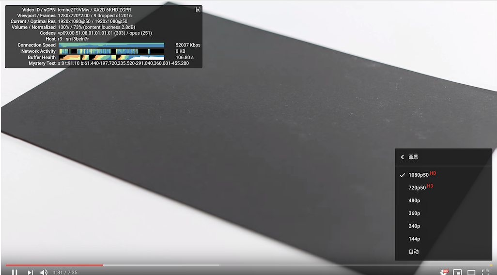
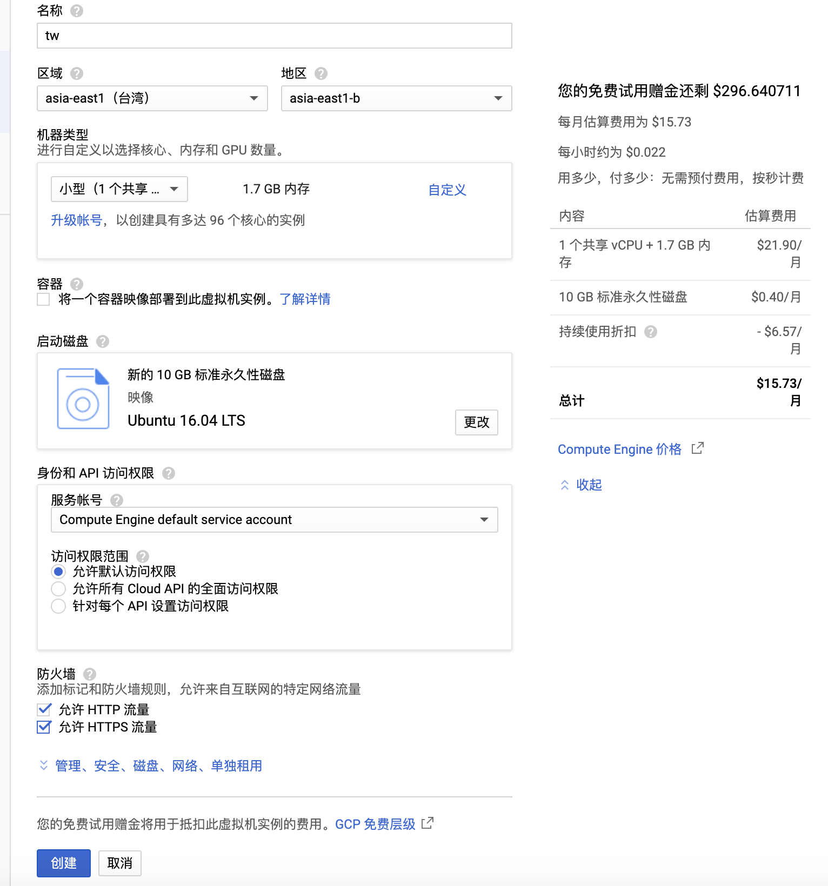
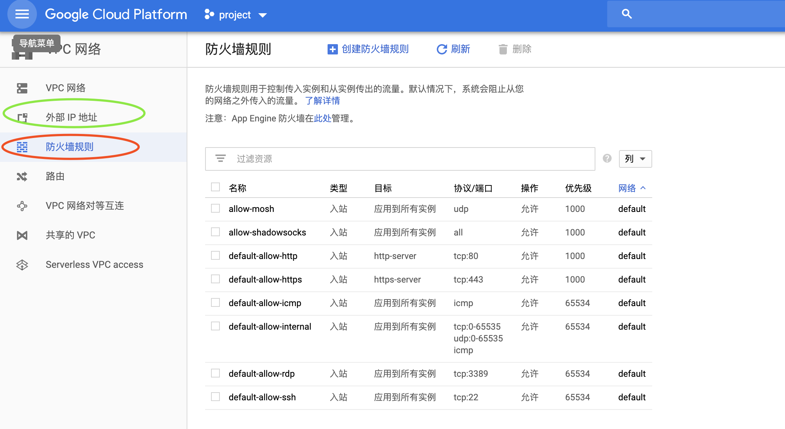

前两年折腾过[亚马逊的免费一年aws并搭建梯子](https://unix2dos.github.io/p/934b1a1.html), 后来发现速度很慢就弃用了. 俗话说免费的是最贵的. 但是google注册之后直接给300刀, 货真价实的钱可以用来买服务器, 简直不要太好用!

> youtube观看1080p无压力



### 1. 注册并申请GCP

https://console.cloud.google.com,  在注册时填写个人资料的时候需要填写visa信用卡验证,可以用自己的visa卡(会扣除1美刀但是会返回, 个别银行visa卡不支持), 当然也可以去万能的某宝购买一个虚拟的信用卡, 价值在10元-30元左右.

<!-- more -->

### 2. 创建服务器实例

在GCP控制中心的` Compute Engine` 的 VM 实例里, 点击创建实例. 这里我选用的是Ubuntu 16.04, 机器类型共享vCPU翻墙足矣.





创建成功后,  可以通过网页上的ssh连接进去.


### 3. 安全组放开, 固定IP

点击VM实例 -> 内部IP -> 下面的链接 进入VPC网络管理




只在vps内关闭防火墙是无效的, 还需要在consle设置防火墙规则. 在`防火墙规则`里创建防火墙规则, 增加要放行的端口(例如接下来要设置的shadowsocks的端口)

另外最好固定下外部ip地址, 否则重启后ip变了, 会非常的麻烦. 在`外部IP地址`里, 增加固定IP即可. 


### 4. 设置第三方ssh登录


通过网页的ssh操作很麻烦, 我们希望直接通过终端直接连接服务器.


准备工作:

```shell
sudo passwd root #给root设置个密码

sudo ufw disable #禁止防火墙, 然并卵, 还需要去控制中心增加防火墙规则

```


修改sshd_config:

```shell
sudo vi /etc/ssh/sshd_config # 修改sshd_config, 允许密码登录

PermitRootLogin no					# 允许root登录, 最好保持默认
PasswordAuthentication yes  # 允许密码登录框

sudo systemctl restart sshd # 最后重启sshd
```


最好避免用root直接登录,  可以切到`root`给自己搞个密码然后再把自己加入到sudoer里面.

然后我们就可以通过终端直接连接到服务器了, 但是发现连接比较卡, 这时候我们需要安装下`mosh`优化ssh的连接


### 4. 安装mosh并开机启动


安装mosh:

```shell
sudo apt install mosh

# 安装后直接把ssh换成mosh, 连接后会发现速度快很多.(需要增加防火墙规则允许mosh的端口)
```


编写`mosh-server` service文件:

```shell
sudo vi /etc/systemd/system/mosh-server.service


[Unit]

Description=Mosh server

After=network.target


[Service]

Environment="LC_ALL=en_US.UTF8"

ExecStart=/usr/bin/mosh-server

Type=forking


[Install]

WantedBy=default.target

```


启动并设置开机启动:

```shell
sudo systemctl daemon-reload

sudo systemctl enable mosh-server

sudo systemctl start mosh-server
```


客户端直接用mosh连接就可以了, 如果报错 `LC_CTYPE=UTF-8` 的问题需要在两台电脑上加上环境变量(.zshrc|.bashrc)

```shell
export LC_ALL=en_US.UTF-8 
export LANG=en_US.UTF-8 
export LANGUAGE=en_US.UTF-8
```


### 5. 安装shadowsocks并开机启动


安装shadowsocks:

```shell
sudo apt update

sudo apt install python-pip

wget https://bootstrap.pypa.io/get-pip.py

sudo python get-pip.py

sudo pip install shadowsocks
```


编写配置文件:

```shell
sudo mkdir /etc/shadowsocks/
sudo vi /etc/shadowsocks/ss-config.json

{
  "server": "0.0.0.0",
  "server_port": 6789, # 服务端端口
  "local_address": "127.0.0.1",
  "local_port": 1080,
  "password": "iampasswd",# 密码
  "timeout": 300,
  "method": "aes-256-cfb",#加密方式
  "fast_open": false
}
```


编写`shadowsocks-server` service文件:

```shell
sudo vi /etc/systemd/system/shadowsocks-server.service

[Unit]
Description=Shadowsocks Server
After=network.target

[Service]
ExecStart=/usr/local/bin/ssserver -c /etc/shadowsocks/ss-config.json
Restart=on-abort

[Install]
WantedBy=multi-user.target
```


启动并设置开机启动:

```shell
sudo systemctl daemon-reload
sudo systemctl enable shadowsocks-server
sudo systemctl start shadowsocks-server
```


接下来就下载小飞机连接即可, [下一篇将写如何为shadowsocks加速.](https://unix2dos.github.io/p/4241e56c.html)
