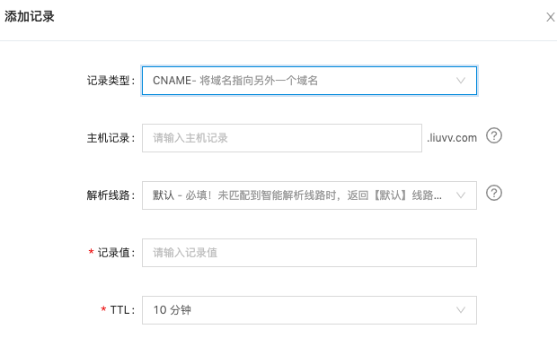
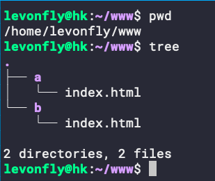
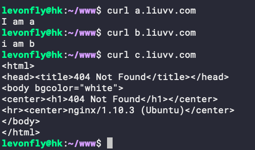
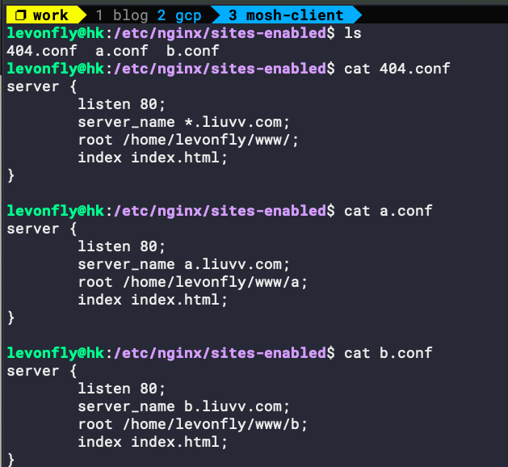

### 1. 域名概念

##### 1.1 二级域名

二级域名是指顶级域名之下的域名, 见下面的例子:

- .com 顶级域名
  - liuvv.com 一级域名(你花钱申请的)
    - www.liuvv.com 二级域名
    - blog.liuvv.com 二级域名
    - 依次类推...

有几点需要注意下:

1. www.liuvv.com是属于二级域名,不过一般我们把这个域名配置指向一级域名访问.
2. www.liuvv.com/news这种形式一般称之为网站的子页面子目录等,并不是二级域名.
3. 另外类似.com.cn, .net.cn, .org.cn这种称之为二级域.

##### 1.2 域名泛解析

我们的目的是实现访问二级域名后转发请求.首先要实现的是二级域名的配置,一般使用Nginx泛解析来处理. 泛解析即利用通配符*来做次级域名以实现所有的次级域名均指向同一IP地址。

泛解析的用途有:

1. 可以让域名支持无限的子域名(这也是泛域名解析最大的用途)。
2. 防止用户错误输入导致的网站不能访问的问题。
3. 可以让直接输入网址登陆网站的用户输入简洁的网址即可访问网站。

<!-- more -->

##### 1.3 域名类型



+ 无论记录类型为啥, 主机记录都填写 xxxxx.liuvv.com
+ 主机记录就是域名前缀，常见用法有：
  + www：解析后的域名为 `www.liuvv.com`
  + @：直接解析主域名 `liuvv.com`
  + \*：泛解析，匹配其他所有域名 `*.liuvv.com`
  
+ 记录类型的含义是什么？

  + **A 记录：**地址记录，用来指定域名的 IPv4 地址（例如`8.8.8.8`），如果需要将域名指向一个 IP 地址，就需要添加 A 记录。

  + **CNAME 记录：** 如果需要将域名指向另一个域名，再由另一个域名提供 IP 地址，就需要添加 CNAME 记录。(github page 就是用的这种)

  + **NS 记录：**域名服务器记录，如果需要把子域名交给其他 DNS 服务商解析，就需要添加 NS 记录。

  + **AAAA 记录：**用来指定主机名（或域名）对应的 IPv6 地址（例如 `ff06:0:0:0:0:0:0:c3`）记录。

  + **MX 记录：**如果需要设置邮箱，让邮箱能收到邮件，就需要添加 MX 记录。

  + **TXT 记录：**如果希望对域名进行标识和说明，可以使用 TXT 记录，绝大多数的 TXT 记录是用来做 SPF 记录（反垃圾邮件）。

  + **SRV 记录：**SRV 记录用来标识某台服务器使用了某个服务，常见于微软系统的目录管理。主机记录处格式为：服务的名字.协议的类型。例如： `_sip._tcp`。

  + **隐、显性 URL 记录：**将一个域名指向另外一个已经存在的站点，就需要添加 URL 记录。


+ 记录值如何填写？

  + **A 记录：**填写您服务器 IP，如果您不知道，请咨询您的空间商。

  + **CNAME 记录：**填写空间商给您提供的域名，例如：`2.com`。

  + **MX 记录：**填写您邮件服务器的 IP 地址或企业邮箱给您提供的域名，如果您不知道，请咨询您的邮件服务提供商。

  + **AAAA 记录：**不常用，解析到 IPv6 的地址。

  + **NS记录：**不常用，系统默认添加的两个 NS 记录请不要修改。NS 向下授权，填写 DNS 域名，例如：`ns3.dnsv3.com`。

  + **TXT 记录：**记录值并没有固定的格式，不过大部分情况下，TXT 记录是用来做 SPF 反垃圾邮件的。最典型的 SPF 格式的 TXT 记录例子为 “`v=spf1 a mx ~all`”，表示只有这个域名的 A 记录和 MX 记录中的 IP 地址有权限使用这个域名发送邮件。

  + **SRV 记录：**记录值格式为：优先级 权重 端口 主机名。例如：`0 5 5060 sipserver.example.com` 。

  + **隐、显性 URL 记录：**记录值为必须为整的地址（必须带有协议、域名，可以包含端口号和资源定位符）。

+ TTL如何填写

  TTL即 Time To Live，缓存的生存时间。指地方 DNS 缓存您域名记录信息的时间，缓存失效后会再次到 DNSPod 获取记录值。我们默认的 600 秒是最常用的，不用修改。

  - 600（10分钟）：建议正常情况下使用 600。

  - 60（1分钟）：如果您经常修改 IP，修改记录一分钟即可生效。长期使用 60，解析速度会略受影响。

  - 3600（1 小时）：如果您 IP 极少变动（一年几次），建议选择 3600，解析速度快。如果要修改 IP，提前一天改为 60，即可快速生效。

    


### 2. 域名配置

##### 2.1 配置泛解析

去域名提供商那里先配置一个泛解析地址,记录类型为A.域名指向一个IPv4地址.主机记录设置为*.记录值填写服务器公网Ip地址.

配置好后稍微等待一下,然后访问这个域名.可以随意输入任何二级域名,访问到的都应该是顶级域名的内容.我这里访问结果总是Nginx的默认页面.


##### 2.2 nginx server_name

nginx http模块 server模块的 `server_name`指令主要用于配置基于名称的虚拟主机.匹配顺序不同结果不同.

a. 精准的server_name配置,如:

```
server_name liuvv.com www.liuvv.com;
```

b. 以通配符*开始的字符串:

```
server_name *.liuvv.com;
```

c. 以通配符*结束的字符串:

```
server_name www.*;
```

d. 配置正则表达式:

```
server_name ~^(?.+)\.liuvv\.com$;
```

匹配顺序由上至下,只要有一项匹配以后就会停止搜索.使用时要注意这个顺序


##### 2.3 绑定子域名到不同目录

通过匹配subdomain, 在下面的可以通过$subdomain这个变量获取当前子域名称。

```nginx
server {
        listen 80 default_server;
        listen [::]:80 default_server;

        server_name  ~^(?<subdomain>.+)\.liuvv\.com$;
        root /home/levonfly/www/$subdomain;
        index index.html;

        location / {
                try_files $uri $uri/ =404;
        }

}
```








##### 2.4 绑定子域名到不同目录(多个配置文件)




### 3. 参考资料

+ [Nginx 泛解析配置请求映射到多端口实现二级域名访问](https://www.cnblogs.com/summit7ca/p/6974215.html)
+ http://www.ruanyifeng.com/blog/2016/06/dns.html
+ https://cloud.tencent.com/document/product/302/3468