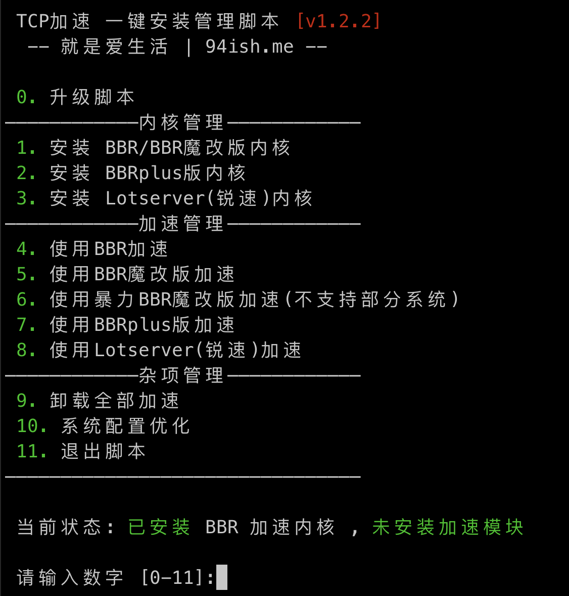
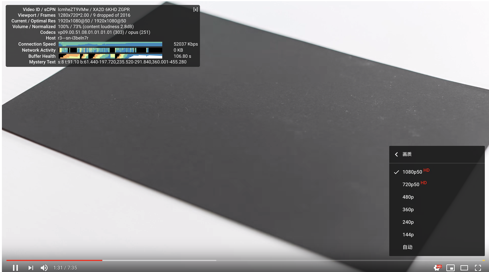

由于国外VPS服务器与国内用户距离较远，连接线路错综复杂，在数据传输过程中的拥堵和丢包较为严重，从而造成连接速度极速下降，极大影响使用体验。通过加速工具对网络加速处理后，可以明显改善网络传输速度，提升用户体验。

如果你正在使用Shadowsocks/V2ray等科学上网工具，那么经过加速后的网络，速度会有几十倍甚至上百倍的提升，在观看Youtube视频时效果尤其明显。


### 1. VPS服务器可用的加速方案

相比OpenVZ架构，KVM的全虚拟化技术，使其系统内核可以被随意更换。有了这一特性加持，KVM架构的服务器基本可以适配所有网络加速方案。

KVM可用主流加速方案：

- 原版BBR
- 魔改BBR
- 锐速
- KCPTUN

除特殊情况外，KVM可用的加速方案，XEN架构也能用。

<!-- more -->

**几种方案的加速效果排行:**

+ 根据加速效果：KCPTUN > 魔改BBR ≥ 锐速 > 原版BBR > 无加速

+ 根据安装便利程度：原版BBR > 魔改BBR > 锐速 ≥ KCPTUN


便利程度这一项有必要详细介绍下：

其实KCPTUN排最后有点委屈，它一不挑架构、二不挑系统，基本是个服务器就能装。之所以排名靠后，仅仅是因为它是唯一需要客户端的加速方案。

锐速为什么排名也靠后？因为它太挑系统内核，对的内核几秒安装成功，不对的内核直接安装不上。


一、KCPTUN

KCPTUN的加速效果最为突出，在使用时，除了需要安装KCPTUN服务器端外，还需要在本地设备上安装KCPTUN客户端。

优点：不挑架构，OpenVZ也能装；不挑系统版本；加速效果非常明显；可以避开TCP流量限速；可以与锐速/BBR同时安装（加速效果不叠加，因为KCPTUN是UDP流量）。

缺点：需要在本地设备安装客户端；仅加速特定端口，不能对服务器上的网站进行加速。

二、锐速

锐速只需在服务器上安装，但是比较挑系统内核，根据站长的使用经验，推荐在Debian 8 /Debian 7 系统上安装锐速，成功率较高。

优点：仅需在服务器端安装，无需客户端，TCP加速效果明显，可以对网站、Shadowsocks/SSR/V2ray流量进行加速。

不足：不支持OpenVZ架构的系统安装；不支持部分系统内核安装。

三、魔改BBR

魔改BBR是原版BBR基础上的第三方激进版本，效果优于原版BBR。

优点：由于是官方BBR基础上的激进版本，所以优点与原版BBR基本一致，加速效果更为明显。

不足：不支持OpenVZ架构的系统，不支持部分系统版本安装。

四、原版BBR

原版BBR由Google出品，集成在Linux系统的最新内核中，低版本内核通过更换新内核的方式安装BBR。

优点：官方新内核集成不占用系统资源，安装成功率高，TCP加速效果比较明显，可以对网站、Shadowsocks/SSR/V2ray流量进行加速。

不足：不支持OpenVZ架构的系统，加速效果略逊于其它几款。


也可以参考网络加速工具的测试:   https://www.ljchen.com/archives/1224


### 2. 判断买的vps使用了什么虚拟技术


```shell
sudo apt install virt-what

sudo virt-what  #我的GCP显示为 kvm
```

如果你的 VPS 使用的是 OpenVZ 的虚拟技术，你是不能使用 BBR 的. 只能安装KCPTUN加速

所以买vps最好买KVM的.


### 3. bbr, 魔改bbr, bbrplus, 锐速开启


+ bbr加速原理: https://blog.sometimesnaive.org/article/8

+ 开启bbr方法: [https://github.com/iMeiji/shadowsocks_install/wiki/%E5%BC%80%E5%90%AF-TCP-BBR-%E6%8B%A5%E5%A1%9E%E6%8E%A7%E5%88%B6%E7%AE%97%E6%B3%95](https://github.com/iMeiji/shadowsocks_install/wiki/开启-TCP-BBR-拥塞控制算法)


我选用的是网上的一键安装脚本, 可以选择安装某个版本并开启 https://loukky.com/archives/479

```shell
wget "https://github.com/cx9208/Linux-NetSpeed/raw/master/tcp.sh" 
chmod +x tcp.sh 
sudo ./tcp.sh
```





由于我安装的是BBRPlus, 此处输入2.  等安装完毕, 重启后再次运行这个脚本, 输入7


在过程中出现下面的弹出框, 选no


最后通过 `lsmod` 看是否安装成功


打开youtube 测试, 发现1080P轻松无压力




### 4. KCPTUN 开启

由于kcptun是用的udp, 而bbr是调整了tcp的发包策略, 两个的加速效果不能叠加

并且kctun还需要在客户端上支持, 所以我就没有再折腾. 感兴趣的可以参考:

<https://blog.kuoruan.com/110.html>