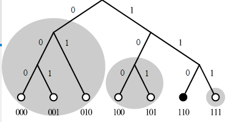

# 0.引言

平常我们高端用户都会用到BT工具来分享一些好玩的资源，例如ubuntu 13.04的ISO安装盘，一些好听的音乐等。这个时候我们会进入一个叫做P2P的网络，大家都在这个网络里互相传递数据，这种分布式的数据传输解决了HTTP、FTP等单一服务器的带宽压力。以往的BT工具（包括现在也有）在加入这个P2P网络的时候都需要借助一个叫Tracker的中心服务器，这个服务器是用来登记有哪些用户在请求哪些资源，然后让请求同一个资源的用户都集中在一起互相分享数据，形成的一个集群叫做Swarm。

这种工作方式有一个弊端就是一旦Tracker服务器出现故障或者线路遭到屏蔽，BT工具就无法正常工作了。所以聪明的人类后来发明了一种叫做DHT（Distributed Hash Table）的去中心化网络。每个加入这个DHT网络的人都要负责存储这个网络里的资源信息和其他成员的联系信息，相当于所有人一起构成了一个庞大的分布式存储数据库。在DHT里定位一个用户和定位一个资源的方法是一样的，他们都使用SHA－1产生的哈希值来作标识。


### 0x1: Kademlia/DHT/KRPC/BitTorrent之间的关系

Kademlia是一个最初提出的框架和理论基础，P2P对等资源共享的思想从这里开始衍生，DHT和KRPC是在Kademlia的基础上进行了包装和发展，BitTorrent是在这三者之上的文件共享分发协议。

<!-- more -->

### 0x2: Magnet URI格式

```
magnet:?xt=urn:btih:<info-hash>&dn=<name>&tr=<tracker-url>

1. <info-hash>: Infohash的16进制编码，共40字符。为了与其它的编码兼容，客户端应当也支持32字符的infohash base32编码 
2. Xt是唯一强制的参数
3. dn是在等待metadata时可能供客户端显示的名字
4. 如果只有一个字段，Tr是tracker的url，如果有很多的tracker，那么多个tr字段会被包含进去 
# dn和tr都是可选的 
```
如果没有指定tracker，客户端应使用DHT来获取peers


### 0x3:P2P的含义

从第一个P2P应用系统Napster的出现开始，P2P技术掀起的风暴为互联网带来了一场空前的变革。P2P不是一个全新的概念，P2P理念的起源可以追溯到20世纪80年代。目前，在学术界、工业界对于P2P没有一个统一的定义。Peer在英语里有“(地位、能力等)同等者”、“同事”和“伙伴”等意义，这样一来，P2P也就可以理解为“伙伴对伙伴”的意思，或称为对等网 

严格地定义纯粹的P2P网络，它是指完全分布的系统，每一个节点都是在功能上和任务上完全相同的。但是这样的定义就会排除掉一些使用“超级节点”的系统或者一些使用中央服务器做一些非核心任务的系统。广义的定义里面指出P2P是一种能善于利用互联网上的存储、CPU周期、内容和用户活动等各种资源的一类应用程序[3]，包括了一些依赖中央服务器才能工作的系统 

P2P这个定义并不是从系统的结构或者内部的操作特征出发考虑的，而是从人们外在的感知角度出发，如果一个系统从直观上看是各个计算机之间直接互相联系的就可以被叫做P2P。当前，技术上比较权威的定义为，P2P系统是一个由直接相连的节点们所构成的分布式的系统[4]，这些节点能够为了共享内容、CPU 时间、存储或者带宽等资源而自我形成一定的网络拓扑结构，能够在适应节点数目的变化和失效的同时维持可以接受的链接能力和性能，并且不需要一个全局服务器或者权威的中介的支持。本文从人们感知的角度出发，采用P2P的广义定义


# 1. Kademlia协议

### 0x1: Kademlia

Kademlia是一种通过分散式杂凑表实现的协议算法，它是由Petar和David为非集中式P2P计算机网络而设计的

```
1. Kademlia规定了网络的结构，也规定了通过节点查询进行信息交换的方式
2. Kademlia网络节点之间使用UDP进行通讯
3. 参与通讯的所有节点形成一张虚拟网(或者叫做覆盖网)。这些节点通过一组数字(或称为节点ID)来进行身份标识
4. 节点ID不仅可以用来做身份标识，还可以用来进行值定位(值通常是文件的散列或者关键词)
5. <font color=red>其实，节点ID与文件散列直接对应，它所表示的那个节点存储着哪儿能够获取文件和资源的相关信息</font>
6. 当我们在网络中搜索某些值(即通常搜索存储文件散列或关键词的节点)的时候，Kademlia算法需要知道与这些值相关的键，然后分步在网络中开始搜索。每一步都会找到一些节点，这些节点的ID与键更为接近，如果有节点直接返回搜索的值或者再也无法找到与键更为接近的节点ID的时候搜索便会停止。这种搜索值的方法是非常高效的
7. 与其他的分散式杂凑表的实现类似，在一个包含n个节点的系统的值的搜索中，Kademlia仅访问O(log(n))个节点。非集中式网络结构还有更大的优势，那就是它能够显著增强抵御拒绝服务攻击的能力。即使网络中的一整批节点遭受泛洪攻击，也不会对网络的可用性造成很大的影响，通过绕过这些漏洞(被攻击的节点)来重新编织一张网络，网络的可用性就可以得到恢复 
```

### 0x2: p2p网络架构演进

```
1. 第一代P2P文件分享网络，像Napster，依赖于中央数据库来协调网络中的查询
2. 第二代P2P网络，像Gnutella，使用泛滥式查询(query flooding)来查询文件，它会搜索网络中的所有节点
3. 第三代p2p网络使用分散式杂凑表来查询网络中的文件，分散式杂凑表在整个网络中储存资源的位置
```

这些协议追求的主要目标就是快速定位期望的节点。Kademlia基于两个节点之间的距离计算，该距离是"两个网络节点ID号的异或"，计算的结果最终作为整型数值返回。关键字和节点ID有同样的格式和长度，因此，可以使用同样的方法计算关键字和节点ID之间的距离。节点ID一般是一个大的随机数，选择该数的时候所追求的一个目标就是它的唯一性(希望在整个网络中该节点ID是唯一的)。异或距离跟实际上的地理位置没有任何关系，只与ID相关。因此很可能来自德国和澳大利亚的节点由于选择了相似的随机ID而成为邻居。选择异或是因为通过它计算的距离享有几何距离公式的一些特征，尤其体现在以下几点

```
1. 节点和它本身之间的异或距离是0
2. 异或距离是对称的：即从A到B的异或距离与从B到A的异或距离是等同的
3. 异或距离符合三角不等式: 三个顶点A B C，AC异或距离小于或等于AB异或距离和BC异或距离之和，这种几何数学特征，可以很好的支撑算法进行寻路路由
```

由于以上的这些属性，在实际的节点距离的度量过程中计算量将大大降低。Kademlia搜索的每一次迭代将距目标至少更近1 bit(每次根据XOR结果，往前选择1bit更近的节点)。一个基本的具有2的n次方个节点的Kademlia网络在最坏的情况下只需花n步就可找到被搜索的节点或值


>因为Kademlia是根据bit位XOR计算得到"相对距离"的，对于越低bit位，XOR可能得到的结果越小，对于越高位的bit位，XOR可能得到的值就越大，并且是呈现2的指数方式增长的，所以，从数学上来说，一个DHT网络中的所有节点，通过这种方式(XOR距离)进行寻址，每次前进一个bit，最大只需要log2N次即可到达目标节点(log2逼近的思路，即bit 2可以表示世界上任何数字)

### 0x3: 路由表(就是K桶,存放端口)

Kademlia路由表由多个列表组成，<font color=red>每个列表对应节点ID的一位(例如: 假如节点ID共有6位，则节点的路由表将包含6个列表)，</font><font color=green>一个列表中包含多个条目，条目中包含定位其他节点所必要的一些数据。列表条目中的这些数据通常是由其他节点的IP地址，端口和节点ID组成。</font>这里仔细思考一下


1. 节点ID的一位就是1bit，假设我们的节点ID是: 111000
2. 对第一个K桶来说，它的列表中的条目必须第一bit不能是1，因为第一个K桶的含义是和该节点的距离是最远的一个分组，第一位不为1，它背后的含义是该分组里的节点和该节点的距离至少在2^6以上，它代表了整个网络中和该节点逻辑距离最远的一些节点 它的列表条目是这样的: 0 00000 ~ 0 111111
3. 对第二个K桶来说，它的列表中的条目的第一位必须是1，表示和当前节点的第一bit相同，第二bit不能是1，这样代表的意思是第二个K桶里的节点和该节点的距离是介于MAX(2bit)和MIN(1bit)之间的距离，它的列表条目是这样的: 10 0000 ~ 10 1111
4. 第三个K桶的情况和前2个相同  
5. 对第四个K桶的来说，它的列表中的条目前三位都是1，第四位不是0，它的列表条目是这样的: 1111 00 ~ 1111 11
6. 后面的bit位情况类推，可以看出，<font color=red>越低bit位的K桶的MAX(XOR)就越小，它的可变范围就越小了。这代表了越低bit位的K桶里存储的都是距离当前节点越近的Nod节点</font>


而条目列表以节点ID的一位(即1bit)来分组是有道理的：我们使用log2N的指数分级方法把除当前节点的全网所有节点都进行了分组，当别的节点来向当前节点请求某个资源HASH的时候，将待搜索寻址的"目标节点ID"和路由表进行异或，会有2种情况

1. 找到某个条目和目标节点XOR为0，即已经寻址成功，则直接返回这个条目给requester即可
2. <font color=red>如果没找到XOR结果为0的条目，则选取那个XOR值最小的条目对应的K桶中的K个条目返回给requester，因为这些条目是最有可能存储了目标节点ID条目的</font>


每个列表对应于与节点相距"特定范围距离"的一些节点，节点的第n个列表中所找到的节点的第n位与该节点的第n位肯定不同，而前n-1位相同

```
1. 这就意味着很容易使用网络中远离该节点的一半节点来填充第一个列表(第一位不同的节点最多有一半)
2. 而用网络中四分之一的节点来填充第二个列表(比第一个列表中的那些节点离该节点更近一位)
3. 依次类推。如果ID有128个二进制位，则网络中的每个节点按照不同的异或距离把其他所有的节点分成了128类，ID的每一位对应于其中的一类
```

随着网络中的节点被某节点发现，它们被逐步加入到该节点的相应的列表中，这个过程中包括

1. <font color=red>向节点列表中存信息: 录入别的节点发布的声明</font>
2. 从节点列表中取信息的操作
3. 甚至还包括当时协助其他节点寻找相应键对应值的操作: 转发其他节点的寻址请求


这个过程中发现的所有节点都将被加入到节点的列表之中，因此节点对整个网络的感知是动态的，这使得网络一直保持着频繁地更新，增强了抵御错误和攻击的能力

---

在Kademlia相关的论文中，列表也称为K桶，其中K是一个系统变量，如20，每一个K桶是一个最多包含K个条目的列表，也就是说，网络中所有节点的一个列表(对应于某一位，与该节点相距一个特定的距离)最多包含20个节点。随着对应的bit位变低(即对应的异或距离越来越短)(bit位越小，可能的距离MAX值就越小了，即距离目标节点的距离越近)，K桶包含的可能节点数迅速下降(K定义的是该bit对应的列表最多能存储K个条目，但不一定都是K存满，当到最低几个bit位的时候，K桶里可能就只有几个个位数的条目了)。由于网络中节点的实际数量远远小于可能ID号的数量，所以对应那些短距离的某些K桶可能一直是空的(如果异或距离只有1，可能的数量就最大只能为1，这个异或距离为1的节点如果没有发现，则对应于异或距离为1的K桶则是空的)




从这个逻辑图中可以看出

```
1. 节点的HASH值决定了它们的逻辑距离，即Kademlia网络中的下一跳寻址是根据HASH XOR的值范围(数值大小范围)结果决定的
2. 该网络最大可有2^3，即8个关键字和节点，目前共有7个节点加入，每个节点用一个小圈表示(在树的底部)
3. 考虑那个用黑圈标注的节点6，它共有3个K桶(即3bit位)

节点0，1和2(二进制表示为000，001和010)是第一个K桶的候选节点
000 -> 110: 6
001 -> 110: 5
010 -> 110: 4

节点3目前(二进制表示为011)还没有加入网络

节点4和节点5(二进制表示分别为100和101)是第二个K桶的候选节点
100 -> 110: 2
101 -> 110: 1 

节点7(二进制表示为111)是第3个K桶的候选节点
111 -> 110: 1
```

图中3个K桶都用灰色圈表示，假如K桶的大小(即K值)是2，那么第一个K桶只能包含3个节点中的2个。众所周知，那些长时间在线连接的节点未来长时间在线的可能性更大，基于这种静态统计分布的规律，Kademlia选择把那些长时间在线的节点存入K桶，这一方法增长了未来某一时刻有效节点的数量(hot hint)，同时也提供了更为稳定的网络。当某个K桶已满，而又发现了相应于该桶的新节点的时候，那么，就首先检查K桶中最早访问的节点，假如该节点仍然存活，那么新节点就被安排到一个附属列表中(作为一个替代缓存). 只有当K桶中的某个节点停止响应的时候，替代cache才被使用。换句话说，新发现的节点只有在老的节点消失(失效)后才被使用


### 0x4: 协议消息

Kademlia协议共有四种消息

```
1. PING消息: 用来测试节点是否仍然在线
2. STORE消息: 在某个节点中存储一个键值对
3. FIND_NODE消息: 消息请求的接收者将返回自己桶中离请求键值最近的K个节点: 将请求者请求的节点HASH和自己的HASH进行XOR计算，将计算结果
4. FIND_VALUE消息: 与FIND_NODE一样，不过当请求的接收者存有请求者所请求的键的时候，它将返回相应键的值
```

每一个RPC消息中都包含一个发起者加入的随机值，这一点确保响应消息在收到的时候能够与前面发送的请求消息匹配


### 0x5: 定位节点

节点查询可以异步进行，也可以同时进行，同时查询的数量由α表示，一般是3


1. 在节点查询的时候，它先得到它K桶中离所查询的键值最近的K个节点(XOR值最小的那个条目所在的分组)，然后向这K个节点发起FIND_NODE消息请求(因为这个K桶内的节点最有可能寻址成功)
2. 消息接收者收到这些请求消息后将在他们的K桶中进行查询，如果他们知道离被查键更近的节点，他们就返回这些节点(最多K个)
    + 找到某个条目和目标节点XOR为0，即已经寻址成功，则直接返回这个条目给requester即可
    + 如果没找到XOR结果为0的条目，则选取那个XOR值最小的条目对应的K桶中的K个条目返回给requester，因为这些条目是最有可能存储了目标节点ID条目的
3. <font color="red">消息的请求者在收到响应后将使用它所收到的响应结果来更新它的结果列表，返回的结果也应该插入到刚才发起请求的那个K桶里，这个结果列表总是保持K个响应FIND_NODE消息请求的最优节点(即离被搜索键更近的K个节点)</font>
4. 然后消息发起者将向这K个最优节点发起查询，因为刚开始的查询很可能K桶里存的不全是目标节点，而是潜在地离目标节点较近的节点
5. 不断地迭代执行上述查询过程。因为每一个节点比其他节点对它周边的节点有更好的感知能力(水波扩散式的节点寻址方式)，因此响应结果将是一次一次离被搜索键值越来越近的某节点。如果本次响应结果中的节点没有比前次响应结果中的节点离被搜索键值更近了(即发现这轮查询的结果未发生diff变化了)，这个查询迭代也就终止了
6. 当这个迭代终止的时候，响应结果集中的K个最优节点就是整个网络中离被搜索键值最近的K个节点(从以上过程看，这显然是局部的，而非整个网络，因为这本质和最优解搜索算法一样，可能陷入局部最优解而无法获得全局最优解) 
7. 节点信息中可以增加一个往返时间，或者叫做RTT的参数，这个参数可以被用来定义一个针对每个被查询节点的超时设置，即当向某个节点发起的查询超时的时候，另一个查询才会发起，当然，针对某个节点的查询在同一时刻从来不超过α个


### 0x6: 定位和冗余拷贝资源

通过把资源信息与键进行映射，资源即可进行定位，杂凑表是典型的用来映射的手段。由于以前的STORE消息，存储节点将会有对应STORE所存储的相关资源的信息。定位资源时，如果一个节点存有相应的资源的值的时候，它就返回该资源，搜索便结束了，除了该点以外，定位资源与定位离键最近的节点的过程相似


1. 考虑到节点未必都在线的情况，资源的值被存在多个节点上(节点中的K个)，并且，为了提供冗余，还有可能在更多的节点上储存值
2. 储存值的节点将定期搜索网络中与储存值所对应的键接近的K个节点并且把值复制到这些节点上，这些节点可作为那些下线的节点的补充
3. 另外，对于那些普遍流行的内容，可能有更多的请求需求，通过让那些访问值的节点把值存储在附近的一些节点上(不在K个最近节点的范围之类)来减少存储值的那些节点的负载，这种新的存储技术就是缓存技术，通过这种技术，依赖于请求的数量，资源的值被存储在离键越来越远的那些节点上(资源热度越高，缓存cache就越广泛)，这使得那些流行的搜索可以更快地找到资源的储存者
5. 由于返回值的节点的NODE_ID远离值所对应的关键字，网络中的"热点"区域存在的可能性也降低了。依据与键的距离，缓存的那些节点在一段时间以后将会删除所存储的缓存值。DHT的某些实现(如Kad)即不提供冗余(复制)节点也不提供缓存，这主要是为了能够快速减少系统中的陈旧信息。在这种网络中，提供文件的那些节点将会周期性地更新网络上的信息(通过NODE_LOOKUP消息和STORE消息)。当存有某个文件的所有节点都下线了，关于该文件的相关的值(源和关键字)的更新也就停止了，该文件的相关信息也就从网络上完全消失了 


### 0x7: 加入网络

1. 想要加入网络的节点首先要经历一个引导过程。在引导过程中，节点需要知道其他已加入该网络的某个节点的IP地址和端口号(可从用户或者存储的列表中获得)。假如正在引导的那个节点还未加入网络，它会计算一个目前为止还未分配给其他节点的随机ID号，直到离开网络，该节点会一直使用该ID号 
2. 正在加入Kademlia网络的节点在它的某个K桶中插入引导节点(加入该网络的介绍人)(负责加入节点的初始化工作)，然后向它的唯一邻居(引导节点)发起NODE_LOOKUP操作请求来定位自己，这种"自我定位"将使得Kademlia的其他节点(收到请求的节点)能够使用新加入节点的Node Id填充他们的K桶(邻居互相认识)
3. 同时也能够使用那些查询过程的中间节点(位于新加入节点和引导节点的查询路径上的其他节点)来填充新加入节点的K桶(相当于完成一个DNS递归查询后，沿途路径上的DNS IP都被记录了)。想象一下这个过程
    + 新加入的节点可能和"引导节点"距离很远，它一上来就向离自己几何距离最远的引导节点问话: "谁知道我自己这个节点在哪?"，引导节点会尽力去回答这个问题，即引导节点会把自己K桶内最有可能知道该节点位置(即离该几点XOR几何距离最近的K个点返回给新加入的请求节点)
    + <font color="red">新加入的请求方收到了K个节点后，把这K个节点保存进自己的K桶，然后继续向这些节点去"询问(发起find_node请求)"自己的节点在哪，这些节点会收到这些请求，同时也把新加入节点保存进自己的K桶内</font>
    + 整个过程和向DNS根域名服务器请求解析某个域名的递归过程类似
4. 这一自查询过程使得新加入节点自引导节点所在的那个K桶开始，由远及近，对沿途的所有节点逐步得到刷新，整条链路上的邻居都认识了这个新邻居
5. 最初的时候，节点仅有一个K桶(覆盖所有的ID范围)，当有新节点需要插入该K桶时，如果K桶已满，K桶就开始分裂，分裂发生在节点的K桶的覆盖范围(表现为二叉树某部分从左至右的所有值)包含了该节点本身的ID的时候。对于节点内距离节点最近的那个K桶，Kademlia可以放松限制(即可以到达K时不发生分裂)，因为桶内的所有节点离该节点距离最近，这些节点个数很可能超过K个，而且节点希望知道所有的这些最近的节点。因此，在路由树中，该节点附近很可能出现高度不平衡的二叉子树。假如K是20，新加入网络的节点ID为"xxx000011001"，则前缀为"xxx0011..."的节点可能有21个，甚至更多，新的节点可能包含多个含有21个以上节点的K桶(位于节点附近的k桶)。这点保证使得该节点能够感知网络中附近区域的所有节点


### 0x8: 查询加速


1. Kademlia使用异或来定义距离。两个节点ID的异或(或者节点ID和关键字的异或)的结果就是两者之间的距离。对于每一个二进制位来说，如果相同，异或返回0，否则，异或返回1。异或距离满足三角形不等式: 任何一边的距离小于(或等于)其它两边距离之和
2. 异或距离使得Kademlia的路由表可以建在单个bit之上，即可使用位组(多个位联合)来构建路由表。位组可以用来表示相应的K桶，它有个专业术语叫做前缀，对一个m位的前缀来说，可对应2^m-1个K桶(m位的前缀本来可以对应2^m个K桶)另外的那个K桶可以进一步扩展为包含该节点本身ID的路由树
3. 一个b位的前缀可以把查询的最大次数从logn减少到logn/b。这只是查询次数的最大值，因为自己K桶可能比前缀有更多的位与目标键相同，这会增加在自己K桶中找到节点的机会，假设前缀有m位，很可能查询一个节点就能匹配2m甚至更多的位组，所以其实平均的查询次数要少的多 
4. 节点可以在他们的路由表中使用混合前缀，就像eMule中的Kad网络。如果以增加查询的复杂性为代价，Kademlia网络在路由表的具体实现上甚至可以是有异构的


### 0x9: 在文件分享网络中的应用

Kademlia可在文件分享网络中使用，通过制作Kademlia关键字搜索，我们能够在文件分享网络中找到我们需要的文件以供我们下载。由于没有中央服务器存储文件的索引，这部分工作就被平均地分配到所有的客户端中去


1. 假如一个节点希望分享某个文件，它先根据文件的内容来处理该文件，通过运算，把文件的内容散列成一组数字，该数字在文件分享网络中可被用来标识文件
2. <font color="red">这组散列数字必须和节点ID有同样的长度，然后，该节点便在网络中搜索ID值与文件的散列值相近的节点，然后向这些被搜索到的节点广播自己(即把它自己的IP地址存储在那些搜索到的节点上)，本质意思是说: "你如果要搜索这个文件，就去找那些节点ID就好了，那些节点ID会告诉搜索者应该到自己这里来(文件发布者)来建立TCP连接，下载文件"，</font><font color="blue">也就是说，它把自己作为文件的源进行了发布(文件共享方式)。正在进行文件搜索的客户端将使用Kademlia协议来寻找网络上ID值与希望寻找的文件的散列值最近的那个节点(寻找文件的过程和寻找节点的机制形成了统一，因为文件和节点的ID的HASH格式是一样的)，然后取得存储在那个节点上的文件源列表</font> 
3. 由于一个键(HASH)可以对应很多值，即同一个文件(通过一个对应的HASH公布到P2P网络中)可以有多个源(因为可能有多个节点都会有这个文件的拷贝)，每一个存储源列表的节点可能有不同的文件的源的信息，这样的话，源列表可以从与键值相近的K个节点获得。 文件的散列值通常可以从其他的一些特别的Internet链接的地方获得，或者被包含在从其他某处获得的索引文件中(即种子文件)
4. 文件名的搜索可以使用关键词来实现，文件名可以分割成连续的几个关键词，这些关键词都可以散列并且可以和相应的文件名和文件散列储存在网络中。搜索者可以使用其中的某个关键词，联系ID值与关键词散列最近的那个节点，取得包含该关键词的文件列表。由于在文件列表中的文件都有相关的散列值，通过该散列值就可利用上述通常取文件的方法获得要搜索的文件


# 2. KRPC 协议 KRPC Protocol

KRPC是BitTorrent在Kademlia理论基础之上定义的一个通信消息格式协议，主要用来支持peer节点的获取(get_peer)和peer节点的声明(announce_peer)，以及判活心跳(ping)、节点寻址(find_node)，它在find_node的原理上和DHT是一样的，同时增加了get_peer/announce_peer/ping协议的支持

KRPC协议是由B编码组成的一个简单的RPC结构，有4种请求：ping、find_node、get_peers 和 announce_peer


### 0x0: bencode编码

bencode 有 4 种数据类型: string, integer, list 和 dictionary

```
1. string: 字符是以这种方式编码的: <字符串长度>:<字符串> 
如 hell: 4:hell

2. integer: 整数是一这种方式编码的: i<整数>e 
如 1999: i1999e

3. list: 列表是一这种方式编码的: l[数据1][数据2][数据3][…]e 
如列表 [hello, world, 101]：l5:hello5:worldi101ee

4. dictionary: 字典是一这种方式编码的: d[key1][value1][key2][value2][…]e，其中 key 必须是 string 而且按照字母顺序排序 
如字典 {aa:100, bb:bb, cc:200}： d2:aai100e2:bb2:bb2:cci200ee
```

KRPC 协议是由 bencode 编码组成的一个简单的 RPC 结构，他使用 UDP 报文发送。一个独立的请求包被发出去然后一个独立的包被回复。这个协议没有重发(UDP是无连接协议)


### 0x1: KRPC字典基本组成元素

一条 KRPC 消息即可能是request，也可能是response，由一个独立的字典组成

```
1. t关键字: 每条消息都包含 t 关键字，它是一个代表了 transaction ID 的字符串。transaction ID 由请求节点产生，并且回复中要包含回显该字段(挑战-响应模型)，所以回复可能对应一个节点的多个请求。transaction ID 应当被编码为一个短的二进制字符串，比如 2 个字节，这样就可以对应 2^16 个请求
2. y关键字: 它由一个字节组成，表明这个消息的类型。y 对应的值有三种情况
    1) q 表示请求(请求Queries): q类型的消息它包含 2 个附加的关键字 q 和 a
        1.1) 关键字 q: 是字符串类型，包含了请求的方法名字(get_peers/announce_peer/ping/find_node)
        1.2) 关键字 a: 一个字典类型包含了请求所附加的参数(info_hash/id..)
    2) r 表示回复(回复 Responses): 包含了返回的值。发送回复消息是在正确解析了请求消息的基础上完成的，包含了一个附加的关键字 r。关键字 r 是字典类型
        2.1) id: peer节点id号或者下一跳DHT节点
                2.2) nodes": "" 
                2.3) token: token
    3) e 表示错误(错误 Errors): 包含一个附加的关键字 e，关键字 e 是列表类型
        3.1) 第一个元素是数字类型，表明了错误码，当一个请求不能解析或出错时，错误包将被发送。下表描述了可能出现的错误码
        201: 一般错误
        202: 服务错误
        203: 协议错误，比如不规范的包，无效的参数，或者错误的 toke
        204: 未知方法 
        3.2) 第二个元素是字符串类型，表明了错误信息
```

以上是整个KRPC的协议框架结构，具体到请求Query/回复Response/错误Error还有具体的协议实现


### 0x2: 请求Query具体协议

所有的请求都包含一个关键字 id，它包含了请求节点的节点 ID。所有的回复也包含关键字id，它包含了回复节点的节点 ID
 
 
 1. `ping`: 检测节点是否可达，请求包含一个参数id，代表该节点的nodeID。对应的回复也应该包含回复者的nodeID

 ```
	ping Query = {"t":"aa", "y":"q", "q":"ping", "a":{"id":"abcdefghij0123456789"}}
	bencoded = d1:ad2:id20:abcdefghij0123456789e1:q4:ping1:t2:aa1:y1:qe
	
	Response = {"t":"aa", "y":"r", "r": {"id":"mnopqrstuvwxyz123456"}}
	bencoded = d1:rd2:id20:mnopqrstuvwxyz123456e1:t2:aa1:y1:re
 ```
 
 2. `find_node`: find_node 被用来查找给定 ID 的DHT节点的联系信息，该请求包含两个参数id(代表该节点的nodeID)和target。回复中应该包含被请求节点的路由表中距离target最接近的K个nodeID以及对应的nodeINFO
	
	```
	find_node Query = {"t":"aa", "y":"q", "q":"find_node", "a": {"id":"abcdefghij0123456789", "target":"mnopqrstuvwxyz123456"}}
	# "id" containing the node ID of the querying node, and "target" containing the ID of the node sought by the queryer. 
	bencoded = d1:ad2:id20:abcdefghij01234567896:target20:mnopqrstuvwxyz123456e1:q9:find_node1:t2:aa1:y1:qe
	
	Response = {"t":"aa", "y":"r", "r": {"id":"0123456789abcdefghij", "nodes": "def456..."}}
	bencoded = d1:rd2:id20:0123456789abcdefghij5:nodes9:def456...e1:t2:aa1:y1:re
	```

	find_node 请求包含 2 个参数，第一个参数是 id，包含了请求节点的ID。第二个参数是 target，包含了请求者正在查找的节点的ID
	
	当一个节点接收到了 find_node 的请求，他应该给出对应的回复，回复中包含 2 个关键字 id(被请求节点的id) 和 nodes，nodes 是字符串类型，包含了被请求节点的路由表中最接近目标节点的 K(8) 个最接近的节点的联系信息(被请求方每次都统一返回最靠近目标节点的节点列表K捅)
	
	```
	参数: {"id" : "<querying nodes id>", "target" : "<id of target node>"}
回复: {"id" : "<queried nodes id>", "nodes" : "<compact node info>"}
	```
	
	这里要明确3个概念
	
	```
	1. 请求方的id: 发起这个DHT节点寻址的节点自身的ID，可以类比DNS查询中的客户端
2. 目标target id: 需要查询的目标ID号，可以类比于DNS查询中的URL，这个ID在整个递归查询中是一直不变的
3. 被请求节点的id: 在节点的递归查询中，请求方由远及近不断询问整个链路上的节点，沿途的每个节点在返回时都要带上自己的id号
	```
	
3. `get_peers`: 获取 infohash 的 peers

	```
	1. get_peers 请求包含 2 个参数(id请求节点ID，info_hash代表torrent文件的infohash，infohash为种子文件的SHA1哈希值，也就是磁力链接的btih值)
2. response get_peer: 
    1) 如果被请求的节点有对应 info_hash 的 peers，他将返回一个关键字 values，这是一个列表类型的字符串。每一个字符串包含了 "CompactIP-address/portinfo" 格式的 peers 信息(即对应的机器ip/port信息)(peer的info信息和DHT节点的info信息是一样的)
    2) 如果被请求的节点没有这个 infohash 的 peers，那么他将返回关键字 nodes(需要注意的是，如果该节点没有对应的infohash信息，而只是返回了nodes，则请求方会认为该节点是一个"可疑节点"，则会从自己的路由表K捅中删除该节点)，这个关键字包含了被请求节点的路由表中离 info_hash 最近的 K 个节点(我这里没有该节点，去别的节点试试运气)，使用 "Compactnodeinfo" 格式回复。在这两种情况下，关键字 token 都将被返回。token 关键字在今后的 annouce_peer 请求中必须要携带。token 是一个短的二进制字符串
	```
	
	
	```
	参数: {"id" : "<querying nodes id>", "info_hash" : "<20-byte infohash of target torrent>"}
	
	回复: 
	{"id" : "<queried nodes id>", "token" :"<opaque write token>", "values" : ["<peer 1 info string>", "<peer 2 info string>"]}
	或: 	
	{"id" : "<queried nodes id>", "token" :"<opaque write token>", "nodes" : "<compact node info>"}
	```
	
4. `announce_peer`: 这个请求用来表明发出 announce_peer 请求的节点，正在某个端口下载 torrent 文件

	announce_peer 包含 4 个参数
	
	```
	1. 第一个参数是 id: 包含了请求节点的 ID
	2. 第二个参数是 info_hash: 包含了 torrent 文件的 infohash
	3. 第三个参数是 port: 包含了整型的端口号，表明 peer 在哪个端口下载
	4. 第四个参数数是 token: 这是在之前的 get_peers 请求中收到的回复中包含的。收到 announce_peer 请求的节点必须检查这个 token 与之前我们回复给这个节点 get_peers 的 token 是否相同(也就说，所有下载者/发布者都要参与检测新加入的发布者是否伪造了该资源，但是这个机制有一个问题，如果最开始的那个发布者就伪造，则整条链路都是一个伪造的错的资源infohash信息了)
	如果相同，那么被请求的节点将记录发送 announce_peer 节点的 IP 和请求中包含的 port 端口号在 peer 联系信息中对应的 infohash 下，这意味着一个一个事实: 当前这个资源有一个新的peer提供者了，下一次有其他节点希望或者这个资源的时候，会把这个新的(前一次请求下载资源的节点)也当作一个peer返回给请求者，这样，资源的提供者就越来越多，资源共享速度就越来越快
	```
	
	一个peer正在下载某个资源，意味着该peer有能够访问到该资源的渠道，且该peer本地是有这份资源的全部或部分拷贝的，它需要向DHT网络广播announce消息，告诉其他节点这个资源的下载地址
	
	```
	arguments:  {"id" : "<querying nodes id>",
	"implied_port": <0 or 1>,
	"info_hash" : "<20-byte infohash of target torrent>",
	"port" : <port number>,
	"token" : "<opaque token>"}
	
	response: {"id" : "<queried nodes id>"}
	```
	
	报文包例子 Example Packets 
	
	```
	announce_peers Query = {"t":"aa", "y":"q", "q":"announce_peer", "a": {"id":"abcdefghij0123456789", "implied_port": 1, "info_hash":"mnopqrstuvwxyz123456", "port": 6881, "token": "aoeusnth"}}
	bencoded = d1:ad2:id20:abcdefghij01234567899:info_hash20:<br />
	mnopqrstuvwxyz1234564:porti6881e5:token8:aoeusnthe1:q13:announce_peer1:t2:aa1:y1:qe
	
	Response = {"t":"aa", "y":"r", "r": {"id":"mnopqrstuvwxyz123456"}}
	bencoded = d1:rd2:id20:mnopqrstuvwxyz123456e1:t2:aa1:y1:re
	```
	
### 0x3: 回复 Responses

回复 Responses的包已经在上面的Query里说明了


### 0x4: 错误 Errors

错误包例子 Example Error Packets

```
generic error = {"t":"aa", "y":"e", "e":[201, "A Generic Error Ocurred"]}
bencoded = d1:eli201e23:A Generic Error Ocurrede1:t2:aa1:y1:ee
```


# 3. BitTorrent协议