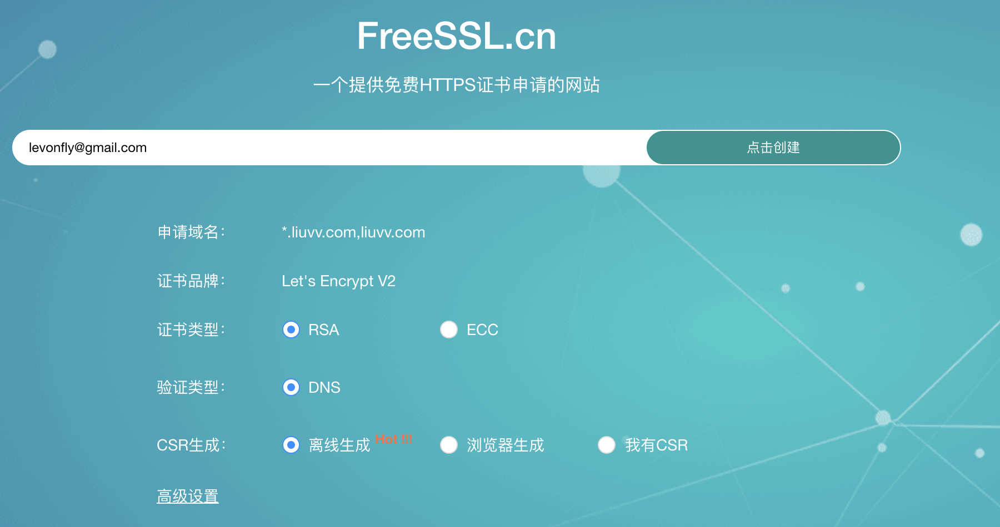
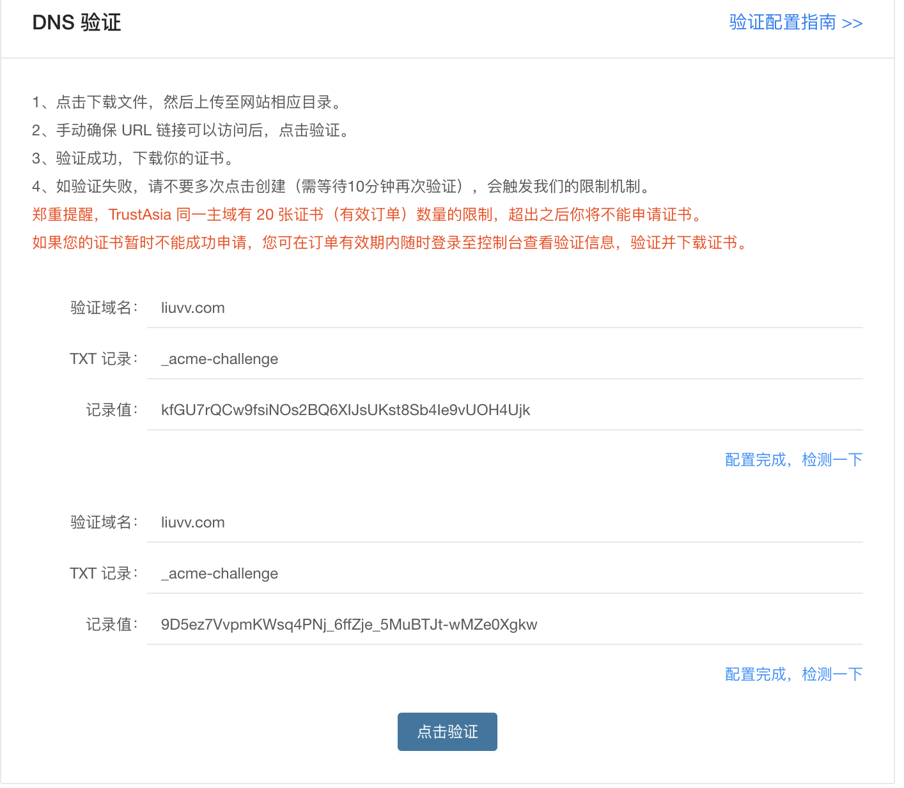

### 1. https 协议简介

HTTPS 协议（HyperText Transfer Protocol over Secure Socket Layer）：可以理解为HTTP+SSL/TLS， 即 HTTP 下加入 SSL 层，HTTPS 的安全基础是 SSL，因此加密的详细内容就需要 SSL，用于安全的 HTTP 数据传输。

> SSL历史和版本

1994年，NetScape公司设计了SSL协议（Secure Sockets Layer）的1.0版，但是未发布。

1995年，NetScape公司发布SSL 2.0版，很快发现有严重漏洞。

1996年，SSL 3.0版问世，得到大规模应用。

1999年，互联网标准化组织ISOC接替NetScape公司，发布了SSL的升级版TLS 1.0版。

2006年和2008年，TLS进行了两次升级，分别为TLS 1.1版和TLS 1.2版。最新的变动是2011年TLS 1.2的修订版。


目前，应用最广泛的是TLS 1.0，接下来是SSL 3.0。但是，主流浏览器都已经实现了TLS 1.2的支持。

---
TLS 1.0通常被标示为SSL 3.1

TLS 1.1为SSL 3.2，

TLS 1.2为SSL 3.3。

<!-- more -->


### 2. https 非对称加密和数字证书

+ HTTPS的数据传输是加密的。实际使用中，HTTPS利用的是对称与非对称加密算法结合的方式。

+ 对称加密，就是通信双方使用一个密钥，该密钥既用于数据加密（发送方），也用于数据解密（接收方）。

+ 非对称加密，使用两个密钥。发送方使用公钥（公开密钥）对数据进行加密，数据接收方使用私钥对数据进行解密。

+ 实际操作中，单纯使用对称加密或单纯使用非对称加密都会存在一些问题，比如对称加密的密钥管理复杂；非对称加密的处理性能低、资源占用高等，因 此HTTPS结合了这两种方式。

+ HTTPS服务端在连接建立过程（ssl shaking握手协议）中，会将自身的公钥发送给客户端。客户端拿到公钥后，与服务端协商数据传输通道的对称加密密钥-对话密钥，随后的这个协商过程则 是基于非对称加密的（因为这时客户端已经拿到了公钥，而服务端有私钥）。

+ 一旦双方协商出对话密钥，则后续的数据通讯就会一直使用基于该对话密钥的对称加密算法了。(对称加密会加快速度)


上述过程有一个问题，那就是双方握手过程中，如何保障HTTPS服务端发送给客户端的公钥信息没有被篡改呢？实际应用中，HTTPS并非直接传输公钥信息，而是使用携带公钥信息的数字证书来保证公钥的安全性和完整性。

数字证书，又称互联网上的"身份证"，用于唯一标识一个组织或一个服务器的，这就好比我们日常生活中使用的"居民身份证"，用于唯一标识一个人。

服务端将数字证书传输给客户端，客户端如何校验这个证书的真伪呢？我们知道居民身份证是由国家统一制作和颁发的，个人向户口所在地公安机关申请，国家颁发的身份证才具有法律效力，任何地方这个身份证都是有效和可被接纳的。

网站的证书也是同样的道理。一般来说数字证书从受信的权威证书授权机构 (Certification Authority，证书授权机构)买来的（免费的很少）。一般浏览器在出厂时就内置了诸多知名CA（如Verisign、GoDaddy、美国国防部、 CNNIC等）的数字证书校验方法，只要是这些CA机构颁发的证书，浏览器都能校验。

对于CA未知的证书，浏览器则会报错。主流浏览器都有证书管理功能，但鉴于这些功能比较高级，一般用户是不用去关心的。


### 3. 让自己的网站支持 https

+ 使用 Let’s Encrypt 提供的免费证书, 放到自己的服务器中, 并且在nginx配置好证书路径, 这样使用浏览器访问的时候就会见到熟悉的绿色小锁头了. 需要注意证书必须颁发给`某个域名`, 所以`ip地址`无效.

+ 安装工具certbot

```
git clone https://github.com/certbot/certbot
cd certbot
chmod +x certbot-auto
	
# certbot-auto 即为自动化脚本工具, 他会判断你的服务是nginx还是apache, 然后执行对应逻辑
./certbot-auto --help
```

+ 生成证书

```bash
# webroot代表webroot根目录模式, certonly代表只生成证书 邮箱亲测没啥大用, 域名一定要和自己要申请证书的域名一致
./certbot-auto certonly --webroot --agree-tos -v -t --email 你的邮箱 -w 服务器根目录 -d 你要申请的域名
	
	
# 实际如下
./certbot-auto certonly --webroot --agree-tos -v -t --email levonfly@gmail.com -w /var/www/html/ -d a.xuanyueting.com
```

然后会在/etc/letsencrypt/目录下生成相关文件, 你所需要的证书其实在`/etc/letsencrypt/live/a.xuanyueting.com/`目录中.

`fullchain.pem`可以看作是证书公钥, `privkey.pem`是证书私钥, 是我们下面需要使用到的两个文件


+ nginx 配置支持 https

```nginx
server {
    listen 80 default_server;
    listen [::]:80 default_server;
    rewrite ^ https://$http_host$request_uri? permanent;
}


server {
	  listen 443 ssl default_server;
    listen [::]:443 ssl default_server;
    ssl_certificate "/etc/letsencrypt/live/a.xuanyueting.com/fullchain.pem";
    ssl_certificate_key "/etc/letsencrypt/live/a.xuanyueting.com/privkey.pem";
    
    root /var/www/html;
    ....
}
```

+ 重启 nginx 验证
	
```bash
sudo service nginx restart
```
访问 a.xuanyueting.com, 会发现出现了小绿锁


### 4. freesn网站免费申请

+ https://freessl.cn/ 注册账号

+ 选择Let's Encrypt V2 支持通配符

  

+ 启动keymanager(需要下载), 设置一个密码

+ 浏览器拉起keymanager, 会自动生成一个csr

+ DNS 验证

  

  CA 将通过查询 DNS 的 TXT 记录来确定您对该域名的所有权。您只需要在域名管理平台将生成的 TXT 记录名与记录值添加到该域名下，等待大约 1 分钟即可验证成功。

  

  需要你到你的域名托管服务商那里添加一条 TXT 记录，其中记录名称为第二行的内容,记录值为第三行的内容。

  

+ 生成证书并且下载, 建议保存到key manager里
	

+ 保存到key manager里, 有效期3个月, 选择导出证书, nginx, 2个文件crt 和 key
  
  
+ Nginx 配置

  ```nginx
  server {
          listen 80 default_server;#一定要加上default_server,否则多个server会找第一个为默认
          listen [::]:80 default_server;#监听所有的ipv6的地址
          rewrite ^ https://$http_host$request_uri? permanent; #https 跳转到 https,永久重定向向
  }
  server {
          listen 443 ssl default_server;
          listen [::]:443 ssl default_server;
          ssl_certificate "/etc/nginx/ssl/*.liuvv.com_chain.crt";
          ssl_certificate_key "/etc/nginx/ssl/*.liuvv.com_key.key";
          root /home/levonfly/www;
          index index.html;
  }
  ```

  

### 5. golang 实现一个最简单的HTTPS Web Server

+ 生成私钥和证书

```
openssl genrsa -out server.key 2048 //生成私钥
openssl req -new -x509 -key server.key -out server.pem -days 3650 //生成证书
```

+ server.go

```
package main
	
import (
	"fmt"
	"net/http"
)
	
func handler(w http.ResponseWriter, r *http.Request) {
	fmt.Fprintf(w, "Hi, This is an example of https service in golang!")
}
	
func main() {
	http.HandleFunc("/", handler)
	http.ListenAndServeTLS(":8081", "server.pem", "server.key", nil)
}
	
```

通过浏览器访问：https://localhost:8081 会出现您的连接不是私密连接, 因为我们使用的是自签发的数字证书
	

+ 客户端访问

```
package main
	
import (
	"crypto/tls"
	"fmt"
	"io/ioutil"
	"net/http"
)
	
func main() {
	//通过设置tls.Config的InsecureSkipVerify为true，client将不再对服务端的证书进行校验。
	ts := &http.Transport{TLSClientConfig: &tls.Config{InsecureSkipVerify: true}} 
	client := &http.Client{Transport: ts}
	
	resp, err := client.Get("https://localhost:8081")
	if err != nil {
		fmt.Println("error:", err)
		return
	}
	defer resp.Body.Close()
	body, err := ioutil.ReadAll(resp.Body)
	fmt.Println(string(body))
}
```


### 对服务端数字证书进行验证

接下来我们来验证一下客户端对服务端数字证书进行验证:

- 首先我们来建立我们自己的CA，需要生成一个CA私钥和一个CA的数字证书:
	
```
openssl genrsa -out ca.key 2048
	
openssl req -x509 -new -nodes -key ca.key -subj "/CN=tonybai.com" -days 5000 -out ca.crt
```

- 接下来，生成server端的私钥，生成数字证书请求，并用我们的ca私钥签发server的数字证书：

```
openssl genrsa -out server.key 2048
	
openssl req -new -key server.key -subj "/CN=localhost" -out server.csr
	
openssl x509 -req -in server.csr -CA ca.crt -CAkey ca.key -CAcreateserial -out server.crt -days 5000
```

- 现在我们的工作目录下有如下一些私钥和证书文件：

```
CA:
私钥文件 ca.key
数字证书 ca.crt

Server:
私钥文件 server.key
数字证书 server.crt
```

+ 客户端验证服务端数字证书

```
package main
	
import (
	"crypto/tls"
	"crypto/x509"
	"fmt"
	"io/ioutil"
	"net/http"
)
	
func main() {
	
	pool := x509.NewCertPool()
	caCrt, err := ioutil.ReadFile("ca.crt")
	if err != nil {
		fmt.Println("ReadFile err:", err)
		return
	}
	pool.AppendCertsFromPEM(caCrt)
	
	ts := &http.Transport{
		TLSClientConfig: &tls.Config{
			RootCAs:            pool,
			InsecureSkipVerify: false,
		},
	}
	client := &http.Client{Transport: ts}
	
	resp, err := client.Get("https://localhost:8081")
	if err != nil {
		fmt.Println("error:", err)
		return
	}
	defer resp.Body.Close()
	body, err := ioutil.ReadAll(resp.Body)
	fmt.Println(string(body))
}
```


### 对客户端的证书进行校验(双向证书校验）

+ 要对客户端数字证书进行校验，首先客户端需要先有自己的证书。

```
openssl genrsa -out client.key 2048
	
openssl req -new -key client.key -subj "/CN=tonybai_cn" -out client.csr
	
openssl x509 -req -in client.csr -CA ca.crt -CAkey ca.key -CAcreateserial -out client.crt -days 5000
```

+ 首先server端需要要求校验client端的数字证书，并且加载用于校验数字证书的ca.crt，因此我们需要对server进行更加灵活的控制：

```
package main
	
import (
	"crypto/tls"
	"crypto/x509"
	"fmt"
	"io/ioutil"
	"net/http"
)
	
func handler(w http.ResponseWriter, r *http.Request) {
	fmt.Fprintf(w, "Hi, This is an example of https service in golang!")
}
	
func main() {
	pool := x509.NewCertPool()
	caCrt, err := ioutil.ReadFile("ca.crt")
	if err != nil {
		fmt.Println("ReadFile err:", err)
		return
	}
	pool.AppendCertsFromPEM(caCrt)
	
	s := &http.Server{
		Addr:    ":8081",
		Handler: http.HandlerFunc(handler),
		TLSConfig: &tls.Config{
			ClientCAs:  pool,
			ClientAuth: tls.RequireAndVerifyClientCert, //强制校验client端证书
		},
	}
	
	s.ListenAndServeTLS("server.crt", "server.key")
}
```

+ client端变化也很大，需要加载client.key和client.crt用于server端连接时的证书校验：

```
package main
	
import (
	"crypto/tls"
	"crypto/x509"
	"fmt"
	"io/ioutil"
	"net/http"
)
	
func main() {
	
	pool := x509.NewCertPool()
	caCrt, err := ioutil.ReadFile("ca.crt")
	if err != nil {
		fmt.Println("ReadFile err:", err)
		return
	}
	pool.AppendCertsFromPEM(caCrt)
	
	cliCrt, err := tls.LoadX509KeyPair("client.crt", "client.key")
	if err != nil {
		fmt.Println("Loadx509keypair err:", err)
		return
	}
	
	ts := &http.Transport{
		TLSClientConfig: &tls.Config{
			RootCAs:            pool, //client端是 RootCAs
			Certificates:       []tls.Certificate{cliCrt},
			InsecureSkipVerify: false,
		},
	}
	client := &http.Client{Transport: ts}
	
	resp, err := client.Get("https://localhost:8081")
	if err != nil {
		fmt.Println("error:", err)
		return
	}
	defer resp.Body.Close()
	body, err := ioutil.ReadAll(resp.Body)
	fmt.Println(string(body))
}
```