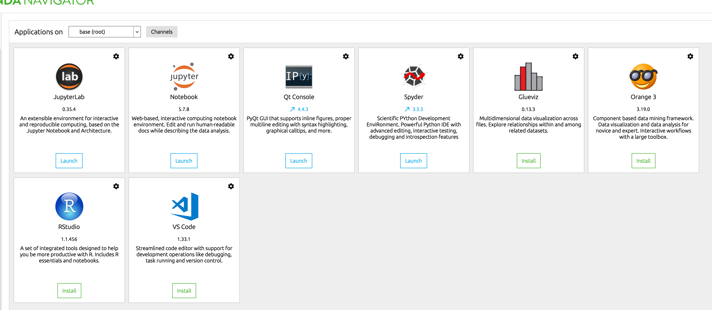
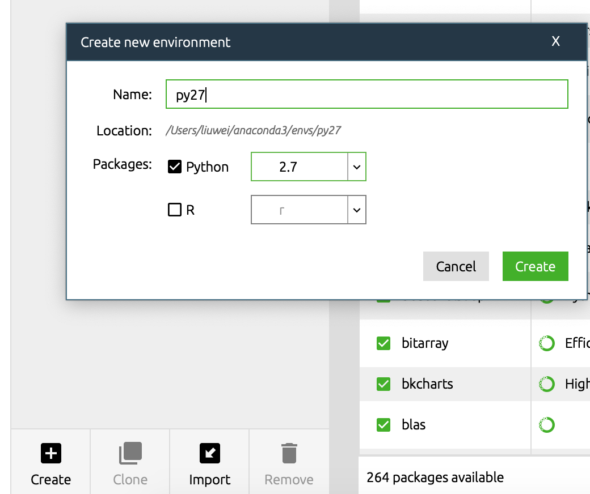
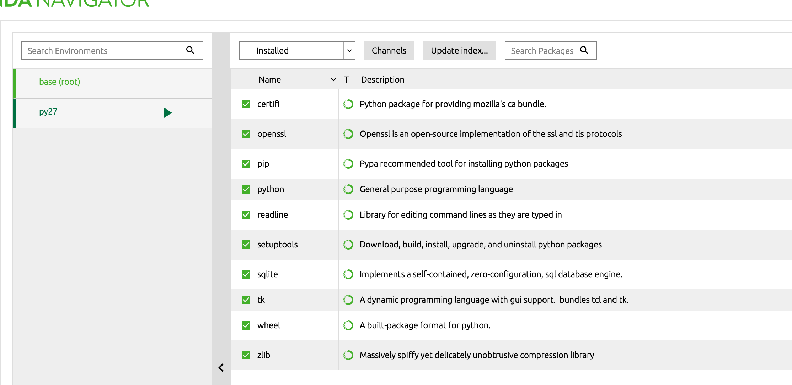
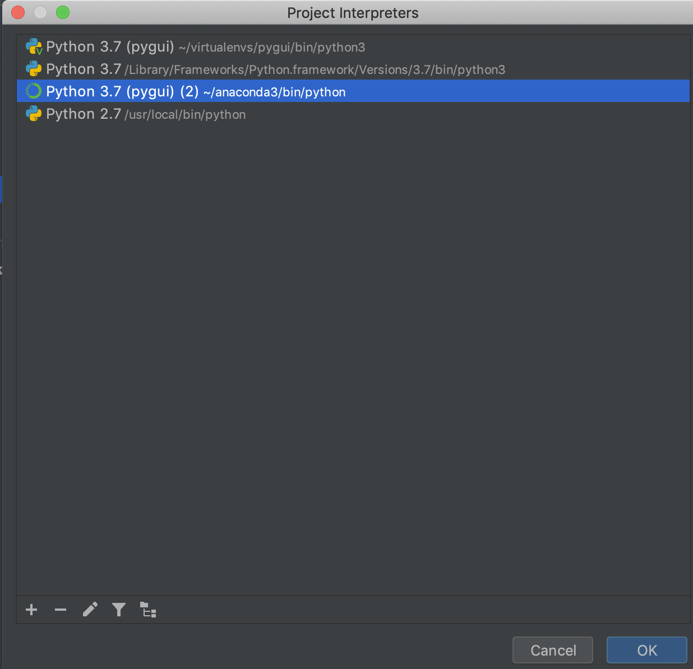

在Python中，安装第三方模块，是通过包管理工具pip完成的。用pip一个一个安装费时费力，还需要考虑兼容性。我们推荐直接使用[anaconda](https://www.anaconda.com/)，这是一个基于Python的数据处理和科学计算平台，它已经内置了许多非常有用的第三方库，我们装上Anaconda，就相当于把数十个第三方模块自动安装好了，非常简单易用。


anaconda 是一个用于科学计算的Python发行版，支持 Linux, Mac, Windows系统，提供了包管理与环境管理的功能，可以很方便地解决多版本python并存、切换以及各种第三方包安装问题。anaconda 利用工具/命令 conda 来进行 package 和 environment 的管理，并且已经包含了Python和相关的配套工具。


这里先解释下conda、anaconda这些概念的差别，详细差别见下节。

1. **anaconda**

anaconda 则是一个打包的集合，里面预装好了 conda、某个版本的python、众多packages、科学计算工具等等，所以也称为Python的一种发行版。其实还有Miniconda，顾名思义，它只包含最基本的内容——python与conda，以及相关的必须依赖项，对于空间要求严格的用户，Miniconda是一种选择。

<!-- more -->

2. **conda**

conda 可以理解为一个工具，也是一个可执行命令，其核心功能是`包管理`与`环境管理`。 包管理与pip的使用类似，环境管理则允许用户方便地安装不同版本的python并可以快速切换。


进入下文之前，说明一下conda的设计理念——**conda将几乎所有的工具、第三方包都当做package对待，甚至包括python和conda自身**！因此，conda打破了包管理与环境管理的约束，能非常方便地安装各种版本python、各种package并方便地切换。


### 1. anaconda、conda、pip、virtualenv的区别


**1. anaconda**

anaconda是一个包含180+的科学包及其依赖项的发行版本。其包含的科学包包括：conda, numpy, scipy, ipython notebook等。


**2. conda**

conda是包及其依赖项和环境的管理工具。

+ 适用语言：Python, R, Ruby, Lua, Scala, Java, JavaScript, C/C++, FORTRAN。
+ 适用平台：Windows, macOS, Linux
+ 用途：快速安装、运行和升级包及其依赖项；在计算机中便捷地创建、保存、加载和切换环境。


如果你需要的包要求不同版本的Python，你无需切换到不同的环境，因为conda同样是一个环境管理器。仅需要几条命令，你可以创建一个完全独立的环境来运行不同的Python版本，同时继续在你常规的环境中使用你常用的Python版本。

+ conda为Python项目而创造，但可适用于上述的多种语言。
+ conda包和环境管理器包含于Anaconda的所有版本当中。


**3. pip**

+ pip是用于安装和管理软件包的包管理器。
+ pip编写语言：Python。
+ Python中默认安装的版本：

Python 2.7.9及后续版本：默认安装，命令为pip
Python 3.4及后续版本：默认安装，命令为pip3


**4. virtualenv**

用于创建一个独立的Python环境的工具。解决问题：
1. 当一个程序需要使用Python 2.7版本，而另一个程序需要使用Python 3.6版本，如何同时使用这两个程序？
2. 如果将所有程序都安装在系统下的默认路径，如：/usr/lib/python2.7/site-packages，当不小心升级了本不该升级的程序时，将会对其他的程序造成影响。
3. 如果想要安装程序并在程序运行时对其库或库的版本进行修改，都会导致程序的中断。
4. 在共享主机时，无法在全局site-packages目录中安装包。

virtualenv将会为它自己的安装目录创建一个环境，这并不与其他virtualenv环境共享库；同时也可以选择性地不连接已安装的全局库。


### 2. pip 与 conda 比较

1. 依赖项检查

   pip：1. 不一定会展示所需其他依赖包。2. 安装包时或许会直接忽略依赖项而安装，仅在结果中提示错误。

   conda：1. 列出所需其他依赖包。2. 安装包时自动安装其依赖项。3. 可以便捷地在包的不同版本中自由切换。

   

2. 环境管理

   pip：维护多个环境难度较大。
   conda：比较方便地在不同环境之间进行切换，环境管理较为简单。

  

3. 对系统自带Python的影响

   pip：在系统自带的Python包中 更新/回退版本/卸载 将影响其他程序。
   conda：不会影响系统自带Python。

  

4. 适用语言

   pip：仅适用于Python。
   conda：适用于Python, R, Ruby, Lua, Scala, Java, JavaScript, C/C++, FORTRAN。


### 2.1 pip集成到conda里用pip安装

```shell
conda install pip

which pip
/Users/liuwei/anaconda3/bin/pip

pip install xxx
```


### 3. conda与pip、virtualenv的关系

conda结合了pip和virtualenv的功能。


### 4. anaconda的安装和使用


**1. 下载安装anaconda**  


下载链接: https://www.anaconda.com/distribution/#download-section

傻瓜安装后, anaconda会把系统Path中的python指向自己自带的Python，并且Anaconda安装的第三方模块会安装在Anaconda自己的路径下，不影响系统已安装的Python目录。

```shell
which python3

/Users/liuwei/anaconda3/bin/python3
```

安装成功后在应用程序里打开 `Anaconda Navigator`，会展示出已经安装好的其他常用应用，如：



+ Anaconda Navigtor ：用于管理工具包和环境的图形用户界面，后续涉及的众多管理命令也可以在 Navigator 中手工实现。

+ Jupyter notebook ：基于web的交互式计算环境，可以编辑易于人们阅读的文档，用于展示数据分析的过程。

+ qtconsole ：一个可执行 IPython 的仿终端图形界面程序，相比 Python Shell 界面，qtconsole 可以直接显示代码生成的图形，实现多行代码输入执行，以及内置许多有用的功能和函数。

+ spyder ：一个使用Python语言、跨平台的、科学运算集成开发环境。


**2. 安装后在终端输入conda 无法识别这个命令:**


```shell
export PATH="${HOME}/anaconda3/bin:$PATH"
```


**3. 修改conda镜像源:**

如不修改conda的镜像源，99.99%会报http链接失败的错误（网友踩坑经验）。

输入以下两条命令来添加清华源：

```shell
conda config --add channels https://mirrors.tuna.tsinghua.edu.cn/anaconda/pkgs/free/ 

conda config --set show_channel_urls yes
```

在家目录下会生成`.condarc`文件, 然后把ssl_verfiy改为false,

```
ssl_verify: true
channels:
  - https://mirrors.tuna.tsinghua.edu.cn/anaconda/pkgs/free/
  - defaults
show_channel_urls: true
```


然后用 conda info 查看当前配置信息，channel URLs 字段内容变为清华即修改成功。


### 5. anaconda python环境的创建和切换

+ 可以在`anaconda-navigator`创建新的环境

  


 也可以命令行创建:

```shell
conda create -n py27 python=2.7 或 conda create --name py27 python=2.7
```


+ 使用如下命令，查看当前有哪些环境：

```shell
conda info -e


WARNING: The conda.compat module is deprecated and will be removed in a future release.

# conda environments:
#

base                  *  /Users/liuwei/anaconda3
py27                     /Users/liuwei/anaconda3/envs/py27

```

星号表示当前激活的环境。


+ 激活py27环境：

```shell
source activate py27 
或 
conda activate py27
```


这时候看python, 已经链接到py27了

```shell
which python

/Users/liuwei/anaconda3/envs/py27/bin/python
```


+ 退出当前环境

```shell
conda deactivate 
或 
source deactivate
```


+ 查看安装了哪些包

```shell
conda list
```

 以后可以通过`anaconda-navigator`在指定环境下安装包




### 6. 配置pycharm使用anaconda环境

在`Project Interpreter` 增加 virtualenvs的特定环境下的执行程序


