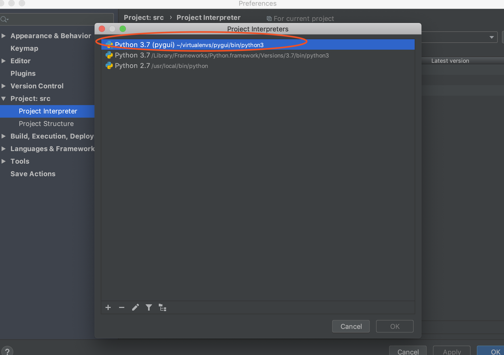

如果我们要同时开发多个应用程序，那这些应用程序都会共用一个Python，就是安装在系统的Python 3。如果应用A需要jinja 2.7，而应用B需要jinja 2.6怎么办？

这种情况下，每个应用可能需要各自拥有一套“独立”的Python运行环境。virtualenv就是用来为一个应用创建一套“隔离”的Python运行环境。


### 1. 安装使用virtualenv(推荐使用virtualenvwrapper)

首先，我们用pip安装virtualenv：

```shell
sudo pip3 install virtualenv
```

然后，假定我们要开发一个新的项目，需要一套独立的Python运行环境，可以这么做：


<!-- more -->

+ 第一步，创建目录：

```shell
mkdir myproject
cd myproject/
```


+ 第二步，创建一个独立的Python运行环境，命名为venv：

```shell
virtualenv --no-site-packages venv

virtualenv -p /Library/Frameworks/Python.framework/Versions/3.7/bin/python3 --no-site-packages venv  # 指定特定的版本创建隔离环境
```


命令virtualenv就可以创建一个独立的Python运行环境，我们还加上了参数--no-site-packages，这样，已经安装到系统Python环境中的所有第三方包都不会复制过来，这样，我们就得到了一个不带任何第三方包的“干净”的Python运行环境。


+ 第三步, 新建的Python环境被放到当前目录下的venv目录。有了venv这个Python环境，可以用source进入该环境：

```shell
source venv/bin/activate
或
. venv/bin/activate
```

注意到命令提示符变了，有个(venv)前缀，表示当前环境是一个名为venv的Python环境。 

（mac iterm2+zsh下会出现蟒蛇哦, 即python的logo）


在venv环境下，用pip安装的包都被安装到venv这个环境下，系统Python环境不受任何影响。也就是说，venv环境是专门针对myproject这个应用创建的。


+ 第四步, 退出当前的venv环境，使用deactivate命令：

```shell
deactivate
```

此时就回到了正常的环境，现在pip或python均是在系统Python环境下执行。

完全可以针对每个应用创建独立的Python运行环境，这样就可以对每个应用的Python环境进行隔离。


virtualenv是如何创建“独立”的Python运行环境的呢？原理很简单，就是把系统Python复制一份到virtualenv的环境，用命令`source venv/bin/activate`进入一个virtualenv环境时，virtualenv会修改相关环境变量，让命令python和pip均指向当前的virtualenv环境。

virtualenv为应用提供了隔离的Python运行环境，解决了不同应用间多版本的冲突问题。


### 2. 安装virtualenvwrapper

virtualenv需要每次使用source命令导入虚拟机运行环境，这一点非常麻烦，另外开发者还有可能忘记虚拟环境目录的建立位置，virtualenvwrapper这一命令行工具就是通过对virtualenv进行封装，解决了上述问题


首先是安装:

```shell
sudo pip3 isntall virtualenvwrapper
```


安装后查找virtualenvwrapper.sh:

```shell
which virtualenvwrapper.sh 

/Library/Frameworks/Python.framework/Versions/3.7/bin/virtualenvwrapper.sh
```


然后修改环境变量配置 `.zshrc`:

```shell
export WORKON_HOME=$HOME/virtualenvs 

export VIRTUALENVWRAPPER_SCRIPT=/Library/Frameworks/Python.framework/Versions/3.7/bin/virtualenvwrapper.sh 

export VIRTUALENVWRAPPER_PYTHON=/Library/Frameworks/Python.framework/Versions/3.7/bin/python3 

export VIRTUALENVWRAPPER_VIRTUALENV=/Library/Frameworks/Python.framework/Versions/3.7/bin/virtualenv 

export VIRTUALENVWRAPPER_VIRTUALENV_ARGS='--no-site-packages' 

source /Library/Frameworks/Python.framework/Versions/3.7/bin/virtualenvwrapper.sh 
```


中间的4行和你本机的python版本和路径要保持一致，此处注意如果不加上面中间4行，则会出现下面的错误：

```shell
/usr/bin/python: No module named virtualenvwrapper
```

至此大功告成，可以方便的使用virtualenvwrapper了。


### 3. 使用virtualenvwrapper


创建虚拟环境:

```shell
mkvirtualenv newenv  
```


这样就建立了一个虚拟的运行环境，而且一开始就处于激活状态，但看不到newenv目录，其实virtualenvwrapper对虚拟机环境作了统一的管理，根据上面配置的环境变量WORK_HOME的路径信息，在其中建立了虚拟运行环境目录.


其他有用的命令:

- workon: 打印所有的虚拟环境；
- mkvirtualenv xxx: 创建 xxx 虚拟环境;
- workon xxx: 使用 xxx 虚拟环境;
- deactivate: 退出 xxx 虚拟环境；
- rmvirtualenv xxx: 删除 xxx 虚拟环境。


### 4. 配置pycharm使用隔离环境

在`Project Interpreter` 增加 virtualenvs的特定环境下的执行程序

