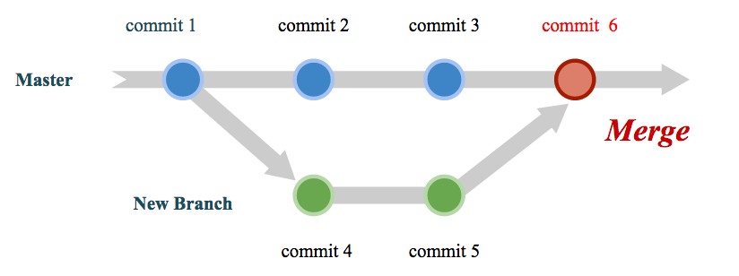
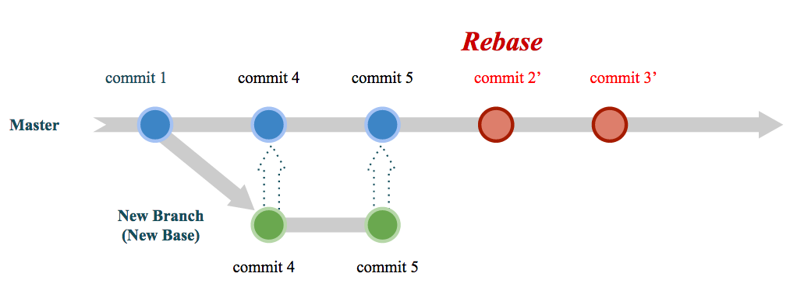
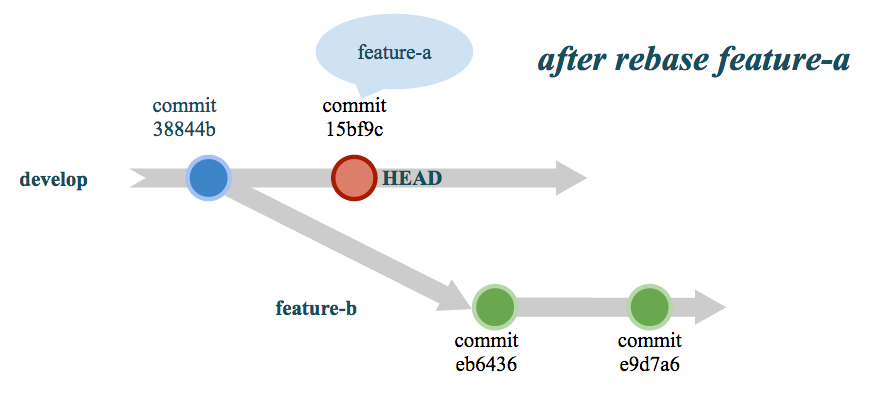
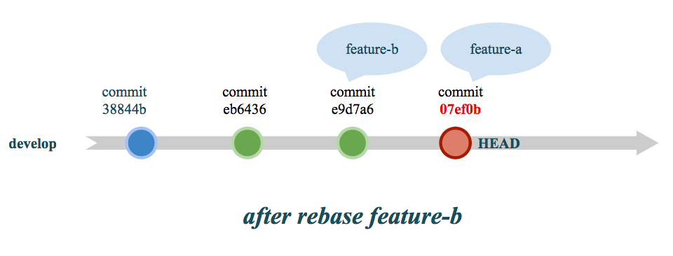
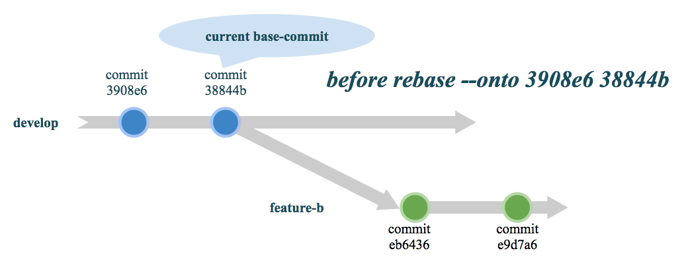
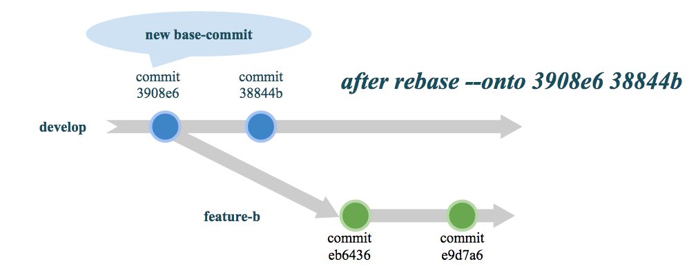

## 什么是rebase 

Rebase对于很多人来说是一个很抽象的概念，也因此它的学习门槛就在于如何了解这个抽象的概念。对于rebase 比较恰当的比喻应该是「移花接木」，简单来讲把你的分支接到别的分支上，稍后我们用几个图来示范merge与rebase 的差异。


了解rebase之前，我们必须了解什么是base。对Git的使用者而言，在分支中进行开发活动是稀松平常的事情，也因此在合并管理分支时，也就需要了解分支是在哪个时间点哪个提交点分出来的旁支，而长出旁支来的提交点，对于旁支来说就是base commit，也就是base。所以简单来说，rebase其实就是改变分支的base的功能。

 

下图是在merge的情况会产生的版本演进的示意图，可以看到在新的分支中所做的变更，在合并之后，一并成为一个新的提交(commit 6)。而commit 1就是New Branch的base。




<!-- more -->

而下图是rebase 的情况下会产生的版本演进的示意图。我们同样是在分支中进行开发的动作，但是在rebase时，与merge不同的是，Git会将分支上所做的变更先暂存起来，接着把newbase (或称新基准点)合并进来，最后直接将刚刚暂存起来的变更在分支上重演，这边用「重演」这个字眼是表示「**rebase不是将提交(commit)复制到分支上，而是将整个变更过程一个一个重新套用到分支上**」 ，也就因为如此commit 2'与commit 3'，才会有另外的'符号表示与原本的commit 2 , commit 3不同，这点可以从commit的SHA1凑值不同看出来，虽然变更的内容相同，但是commit编号是不同的。本文会在稍后利用范例演示一遍。



也就因为如此，所以rebase的行为就很像「移花接木」，以上图来说，就是把New Branch的变更整个接到Master上。这样的好处就是 commit 更像一条直线,更优雅.

 


## Rebase -基础用法

以下我们用一个情境示范rebase的「基础用法」：

> 你是一位team leader，你的其中一项职务就是负责进行程式码审查(code review)，并且将不同程式分支进行合并管理。
>
> 现在有2位程式设计师以develop分支为基础，分别开了新的分支feature-a与feature-b，也都已经完工了。你希望利用rebase的方式将这2个分支并入develop中。

 首先，develop的日志如下所示：

```
commit 38844ba14312c642dcd0f72baf031de0c50ad736
Author: one.man.army <one.man.army@example.com>
Date: Mon Sep 22 15:41:04 2014 +0800

    add HelloWorld.c

commit 3908e6bc1007f12566fdb5a0fb43f4055560b880
Author: one.man.army <one.man.army@example.com>
Date: Mon Sep 22 15:40:42 2014 +0800

    initial commit
```

接着，feature-a的日志如下所示:

```
commit 15bf9c8954633700211f5b9d246ae67d8135cf29
Author: one.man.army <one.man.army@example.com>
Date: Mon Sep 22 15:42:48 2014 +0800

    add feature_a.c

commit 38844ba14312c642dcd0f72baf031de0c50ad736
Author: one.man.army <one.man.army@example.com>
Date: Mon Sep 22 15:41:04 2014 +0800

    add HelloWorld.c

commit 3908e6bc1007f12566fdb5a0fb43f4055560b880
Author: one.man.army <one.man.army@example.com>
Date: Mon Sep 22 15:40:42 2014 +0800

    initial commit
```

最后是feature-b的日志：

```
commit e9d7a6f8b27bca86ef298911d84891b8a7efeada
Author: one.man.army <one.man.army@example.com>
Date: Mon Sep 22 15:45:37 2014 +0800

    add #include <stdio.h>

commit eb6436b59b7a0624f3ec5e5469ac36b37b5211e7
Author: one.man.army <one.man.army@example.com>
Date: Mon Sep 22 15:43:55 2014 +0800

    add feature_b.c

commit 38844ba14312c642dcd0f72baf031de0c50ad736
Author: one.man.army <one.man.army@example.com>
Date: Mon Sep 22 15:41:04 2014 +0800

    add HelloWorld.c

commit 3908e6bc1007f12566fdb5a0fb43f4055560b880
Author: one.man.army <one.man.army@example.com>
Date: Mon Sep 22 15:40:42 2014 +0800

    initial commit
```

可以看到feature-a与feature-b分别比develop多出了1, 2个提交。


身为一名专业的team leader，我们有着足够的信心，相信这2个分支运作的很好，因此我们用以下指令进行rebase。

```
$ git checkout develop
$
$ git rebase feature-a
First, rewinding head to replay your work on top of it...
Fast-forwarded develop to feature-a.
$
$ git rebase feature-b
First, rewinding head to replay your work on top of it...
Applying: add feature_a.c
```

在上述指令中，我们先切换到develop分支中，接着我们很快的就利用指令git rebase <newbase>合并了feature-a与feature-b。此外，在上述的指令执行结果中，可以看到一行讯息显示Fast-forwarded develop to feature-a，其中的Fast-forwarded是什么意思呢？

> Fast-forwarded指的就是当2个分支的头尾相接时，代表2者之间不会有conflict ，因此只要改HEAD的指向就能够迅速合并了。以本情境为例，develop的最后一个提交正好是feature-a的头，所以这两者的rebase适用Fast-forwarded模式。

接下来，可以用git log看看develop的日志，我们可以从日志中发现feature-a与feature-b的commit ID都不一样了。

```
$ git log
commit 07ef0b8e0b1edd079fb8b69f6e6e215725b5aba4
Author: spitfire-sidra <spitfire.sidra@gmail.com>
Date: Mon Sep 22 15:42:48 2014 +0800

    add feature_a.c

commit e9d7a6f8b27bca86ef298911d84891b8a7efeada
Author: spitfire-sidra <spitfire.sidra@gmail.com>
Date: Mon Sep 22 15:45:37 2014 +0800

    add #include <stdio.h>

commit eb6436b59b7a0624f3ec5e5469ac36b37b5211e7
Author: spitfire-sidra <spitfire.sidra@gmail.com>
Date: Mon Sep 22 15:43:55 2014 +0800

    add feature_b.c

commit 38844ba14312c642dcd0f72baf031de0c50ad736
Author: spitfire-sidra <spitfire.sidra@gmail.com>
Date: Mon Sep 22 15:41:04 2014 +0800

    add HelloWorld.c

commit 3908e6bc1007f12566fdb5a0fb43f4055560b880
Author: spitfire-sidra <spitfire.sidra@gmail.com>
Date: Mon Sep 22 15:40:42 2014 +0800

    initial commit
```

以上就是最简单的rebase过程。

但是在这过程中，有些人可能产生了几个疑问——「为什么先rebase feature-a再rebase feature-b后，会是feature-a的日志在最上方呢？」

这是由于rebase会先找出与newbase之间最近的一个共同base，然后先保留HEAD所在分支(也就是当前分支)从共同base开始的所有变更，接着从共同base开始，将newbase的变更重新套用到HEAD的所在分支后，再将方才所保留的当前分支变更一个一个套用进来，也因此feature-a会是最后的一个commit。


我们一样以图示进行说明。下图**After rebase feature-a**是rebase feature-a之后的样子，可以看到rebase feature-a之后develop与feature-b的共同base是commit 38844b，因此如果要再rebase feature-b的话，commit 15bf9c会先被暂存起来，先进行rebase feature-b之后，再将刚刚暂存的commit 38844b重演一次，所以在图**After rebase feature-b**中feature-a的commit ID就从338844b变成07ef0b，这就是rebase的过程了。




After rebase feature-a




After rebase feature-b


问题又来了，刚刚学的rebase会将整个分支都接上去，有时候我们不需要整个分支都接上去，只要接到分支上的某个提交的点即可，这种情况下可以使用rebase – onto进行。

假设只需要接到feature-b的commit eb6436时，就可以用以下指令进行rebase：

```
$ git rebase feature-b --onto eb6436
```

又或者，想要把我们现在的分支整个接到某个分支点上面时，可以选择另一种用法：

```
$ git rebase --onto <new base-commit> <current base-commit>
```

例如，我们在feature-b分支上时，想把整个分支接到commit 3908e6 (initial commit)时，可以输入以下指令：

```
$ git co feature-b #先切换到feature-b
$ git rebase --onto 3908e6 38844b
```

下面2 张图就是执行上述指令的前后对照。



before rebase –onto 3908e6 38844b




after rebase –onto 3908e6 38844b


## Rebase -进阶互动模式

Rebase的互动模式十分强大，可以允许我们交换提交的次序、修改提交内容、合并提交内容，甚至将一个提交拆解成多个提交。

要进入互动模式的基本指令如下，base commit可以是分支上的任意一点：

```
$ git rebase -i <base commit>
```

例如，我们想利用互动模式将feature-b上的提交做一些整理时，就可以用以下指令进入互动模式：

```
$ git rebase -i 38844b
```

上述指令的意思就是我们希望将feature-b从commit 38844b之后的所有提交(`不含commit 38844b `)进行整理。

接着就会出现类似以下的讯息：

```
pick 1011f14 add feature_b.c
pick d26076a add #include <stdio.h>

# Rebase 38844ba..d26076a onto 38844ba
#
# Commands:
# p, pick = use commit
# r, reword = use commit, but edit the commit message
# e, edit = use commit, but stop for amending
# s, squash = use commit, but meld into previous commit
# f, fixup = like "squash", but discard this commit's log message
# x, exec = run command (the rest of the line) using shell
#
# These lines can be re-ordered; they are executed from top to bottom.
#
# If you remove a line here THAT COMMIT WILL BE LOST.
#
# However, if you remove everything, the rebase will be aborted.
#
# Note that empty commits are commented out
```

在进一步操作前，我们必须对讯息上的几个指令(commands)进行说明：

| pick:   | 保留此提交                                                   |
| ------- | ------------------------------------------------------------ |
| reword: | 修改提交的讯息(只改提交讯息)                                 |
| edit:   | 保留此提交，但是需要做一些修改(例如在程式里面多加些注解)     |
| squash: | 保留此提交，但是将上面的提交一并并入此提交，此动作会显示提交讯息供人编辑 |
| fixup:  | 与squash相似，但是此提交的提交讯息会被上面的提交讯息取代     |
| exec:   | 执行shell指令，例如**exec make test**进行一些测试，可以随意穿插在提交点之间 |

### 变换顺序

接下来，简单示范变换提交的顺序，此处我们想把提交的顺序变成先commit 1011f14再来才是commit d26076a，我们只要简单将上述的rebase讯息换成如下的讯息，也就是两行互换即可，就能够变换顺序了！

```
# 此处调换次序即可
pick d26076a add #include <stdio.h>
pick 1011f14 add feature_b.c

# Rebase 38844ba..d26076a onto 38844ba
#
# Commands:
# p, pick = use commit
# r, reword = use commit, but edit the commit message
# e, edit = use commit, but stop for amending
# s, squash = use commit, but meld into previous commit
# f, fixup = like "squash", but discard this commit's log message
# x, exec = run command (the rest of the line) using shell
#
# These lines can be re-ordered; they are executed from top to bottom.
#
# If you remove a line here THAT COMMIT WILL BE LOST.
#
# However, if you remove everything, the rebase will be aborted.
#
# Note that empty commits are commented out
```

### 修改提交内容

有些时候，我们提交之后，不免会注解忘了加或是程式内还有测试的code忘记清掉。这时候除了用git reset –soft HEAD^之外，也可以用rebase编辑那些需要修正的提交。

例如，我们希望用rebase在commit 1011f14中添加几个提交，就可以将pick改成edit进入编辑状态。

```
pick 1011f14 add feature_b.c
edit d26076a add #include <stdio.h>

# Rebase 38844ba..d26076a onto 38844ba
#
# Commands:
# p, pick = use commit
# r, reword = use commit, but edit the commit message
# e, edit = use commit, but stop for amending
# s, squash = use commit, but meld into previous commit
# f, fixup = like "squash", but discard this commit's log message
# x, exec = run command (the rest of the line) using shell
#
# These lines can be re-ordered; they are executed from top to bottom.
#
# If you remove a line here THAT COMMIT WILL BE LOST.
#
# However, if you remove everything, the rebase will be aborted.
#
# Note that empty commits are commented out
```

接下来，如果用git status就可以看到我们正在rebase的讯息：

```
$ git status
rebase in progress; onto 38844ba
You are currently editing a commit while rebasing branch 'Feature-B' on '38844ba'.
  (use "git commit --amend" to amend the current commit)
  (use "git rebase --continue" once you are satisfied with your changes)

nothing to commit, working directory clean
```

**如果你只是想修正提交讯息**，就可以用以下指令：

```
$ git commit --amend
```

**如果你需要多增加几个提交，直接编辑吧**，接着用git add <file> , git commit -m <message>等一般操作进行。最后再利用以下指令完成rebase：

```
$ git rebase --continue
```

**又或者，我们现在编辑的提交实在是太大了，可能对程式码审查的人造成困扰，例如同时修正太多个档案，我们希望拆成比较明确的多个提交**，就可以用以下指令回到未提交前的状态：

```
$ git reset HEAD^
```

然后就可以用git status列出这个提交中变更了多少档案，然后依照需求一个一个用git add加进去后提交，多提交个几次，就等于是将一个提交拆成多个提交啰！不过别忘了，要用以下指令结束rebase。

```
$ git rebase --continue
```

以上就是rebase的几个简单说明与操作。

至于squash , fixup以及exec就留给各位去体验了！


## Rebase出现问题时的处理方法

Rebase与merge一样都可能会产生**conflict**，这时候除了修正**conflict**之后再用git add <file> , git rebase –continue完成rebase之外，也可以用git rebase –abort直接放弃rebase。

```
git rebase (--continue | --abort | --skip)
```

此外，对于rebase使用不慎时，我们会希望能够直接回复到rebase之前的状态，以下就是几个指令可以用来回复到rebase之前的状态。参考自[StackOverFlow](http://stackoverflow.com/questions/134882/undoing-a-git-rebase)。

回复方法1 ：

```
# 最简单的用法
$ git reset --hard ORIG_HEAD
```

回复方法2 ：

```
# rebase 之前先上tag
$ git tag BACKUP
$ ... # rebase 过程
$ ... # rebase 过程
$ git reset --hard BACKUP # 失败的话可以直接回复到tag BACKUP
```

回复方法3 ：

```
$ git reflog # 寻找要回复的HEAD ，以下假设是HEAD@{3}
$ git reset --hard HEAD@{3} # 回复
```